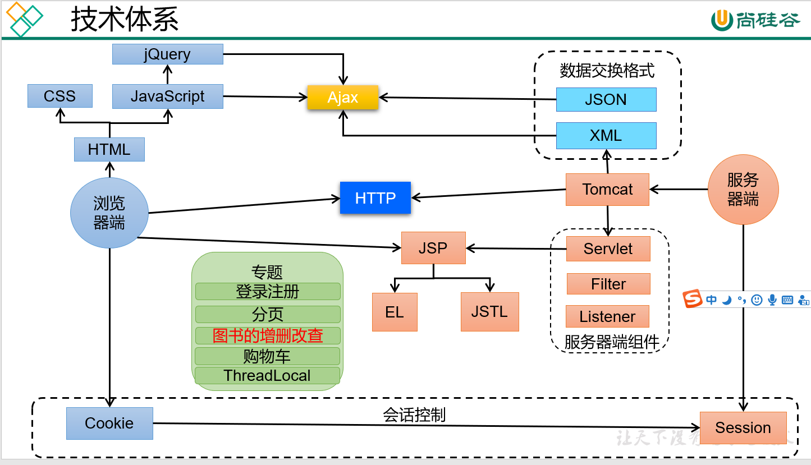
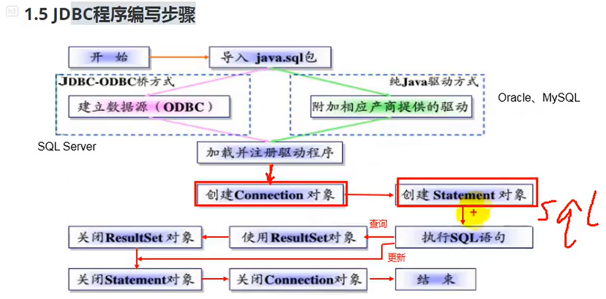
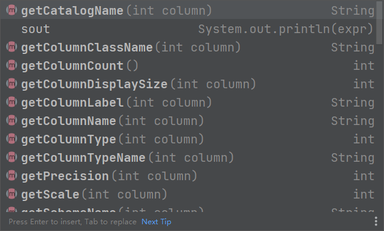

#  JDBC

##   WEB技术体系概览



## 第一章-JDBC概述

### java中数据库存取存储技术  

JDBC直接访问数据库  

JDO技术 Java Data Object  

第三方工具O/R工具  如Hibernate，Mybatis等 

JDBC是java访问数据库的基石，JDO，Hibernate，Mybatis只是更好的封装了JDBC  

###  JDBC 介绍

Java DataBase Connectivity  

JDBC为访问不同的数据库提供了统一的途径，为开发者屏蔽了一些细节问题     

**JDBC是sun公司提供的一套用于数据库操作的接口，java程序员只需要面向这个接口编程即可**

不同的数据库厂商，需要针对这套接口，提供不同的实现，不同的实现的集合即为不同的数据库的驱动  

​																————面向接口编程  



## 第二章-获取链接

### interface Driver 概述  

### 快速入门步骤  

主要就是

1.导入驱动jar包  

​		①复制驱动jar包 mysql的 到项目的libs目录下 （没有libs自己建和项目同级别）

​		②右键libs目录--->Add AS Library

2.注册驱动

```java
Class.forName("com.mysql.jdbc.Driver");//mysql5之后可以不写，后面的Name一般从配置文件导入，详见附录一
```

3.获取数据库对象 Connection

```java
Connection connection = DriverManager.getConnection("jdbc:mysql://localhost:3306/girls","root","1234");
//参数都可以从配置文件导入详见附录一
```

4.定义SQL

```java
String sql ="SELECT * from user where username = ? and password = ?";
```

注意：参数使用 ？作为占位符，例如上

5.获取执行sql语句的对象

```java
PreparedStatement statement = connection.prepareStatement(sql);
```

6.给' ？'赋值:

```java
SetXxx(参数1，参数2); //参数1是问号的位置（从1开始），参数2是问号的值
```

7.执行sql，接收返回结果  

```java
boolean count = PreparedStatement.execute();//PreparedStatement不用传入参数
```

8.处理结果 

```java
System.out.println(count);
```

9.释放资源 

```java
PreparedStatement.close();
connection.close();
```

## 详解手动连接步骤中的对象

### DriverManager 

驱动管理对象 是一个类不是接口  

功能

#####  1-注册驱动 

告诉程序应该使用哪个数据库驱动jar包 

static void registerDriver(Driver driver)  

`Class.forName("com.mysql.jdbc.Driver");`

随着Driver类加载器运行的静态代码块  

```java
static {
    try {
        DriverManager.registerDriver(new Driver());//注册驱动的方法
    } catch (SQLException var1) {
        throw new RuntimeException("Can't register driver!");
    }
}
```

#####  2-获取数据库连接 

```java
//方法
public static Connection getConnection(String url,
    String user, String password)
```

**url：指定连接的路径**  

语法： 

```
JDBC:mysql://ip地址(域名):端口号/数据库名称
例子:jdbc:mysql://localhost:3306/girls","root","1234"
```

细节：如果连接的是本机的服务器，并且mysql服务默认是3306，则url可以简写为：

jdbc:mysql:///数据库名

### Connection对象（接口）

功能

#### 1.获取执行sql的对象

```java
//傻傻的Statement statement = connection.createStatement();
PreparedStatement preparedStatement = connection.prepareStatement();
```

#### 2.管理事务

```java
//开启事务
connection.setAutoCommit(false);
//提交事务
connection.commit();
//回滚事务
connection.rollback();
```

### 傻傻的Statement接口

```java
//1.执行任何语句  返回true代表第一个结果是ResultSet对象，返回false代表结果是更新记数或者没有结果  
boolean bool = statement.execute(String sql);
//2.执行DML insert update delete语句,DDL(create,alter,drop)语句,返回值是影响的行数
//也就是   返回值>0   则执行成功
int executeUpdate(String sql);
//3.执行DQL(Select)语句  返回结果集对象
ResultSet executeQuery(String sql):
```

### ResultSet对象

```java
boolean next();//游标向下移动一行
//并且判断这一行有没有数据，有数据返回true
getXxx(参数);//获取数据
	//Xxx代表数据类型  如： int getInt(); String getString(); Double getDouble();
参数具有两种类型 
    当参数为int 代表列的编号， 从1 开始 如： getString(1);
	当参数为String  代表列名 ，  如:  getDouble("balance");
```

ResultSet有一个结果集的元数据

获取方法:

```java
rs = pre.executeQuery();
ResultSetMetaData metaData = rs.getMetaData();
```

通过这个对象可以获得结果集的列数，某一列的列名等，一般用于结合反射实现通用的查询增加之类的函数

还有用到可变参数Object...args	

getColumnLabel()获取列的别名  



### 抽取JDBC工具类：JDBCUtils

 用于简化书写 

1.抽取注册驱动

2.抽取方法连接对象

3.抽取一个方法释放资源

### 聪明的PreparedStatement

预编译的sql

除了解决Statement的拼串，sql问题之外，PreparedStatement还有那些好处呢？

1.PreparedStatement操作Blob的数据，Statement做不到

其他都一样，想获取图片，需要在获得结果集之后，getBlob获得Blob对象。通过Blob对象获得输入流  

创建输出流，通过输入流的内容，写入到本地；

2.PreparedStatement可以实现高效的批量操作

### Blob操作

```java
import JDBCUtils.JDBCUtils;

import java.io.FileInputStream;
import java.io.FileNotFoundException;
import java.io.IOException;
import java.sql.Connection;
import java.sql.PreparedStatement;
import java.sql.SQLException;

public class InsertPhoto {
    public static void main(String[] args) {
        String sql="update beauty set photo = ?";
        update(sql);
    }
    public static  void update(String sql)  {
        Connection conn=null;
        PreparedStatement ps=null;
        FileInputStream fs = null;
        try {
            conn = JDBCUtils.getConnection();
            ps = conn.prepareStatement(sql);
            fs = new FileInputStream("A:\\real_R\\VScode\\lovebox\\a1.jpg");
            ps.setBlob(1,fs);
            ps.execute();
        } catch (SQLException throwables) {
            throwables.printStackTrace();
        } catch (FileNotFoundException e) {
            e.printStackTrace();
        } finally {
            JDBCUtils.close(ps,conn);
            if(fs!=null) {
                try {
                    fs.close();
                } catch (IOException e) {
                    e.printStackTrace();
                }
            }
        }
    }
}
```

### 批量操作Batch

用到三个方法

1.addBatch(),executeBatch(),clearBatch();

分别是攒batch，执行batch，清空batch 

使用batch需要在配置文件中库名后面写入?rewriteBatchedStatements=true；

用于减少execute次数 

还有就是用到使得Connection对象不得自动提交，把所有的数据缓存了再一起提交

```java
//批量插入的方式四：设置连接不允许自动提交数据
	@Test
	public void testInsert3() {
		Connection conn = null;
		PreparedStatement ps = null;
		try {
			
			long start = System.currentTimeMillis();
			
			conn = JDBCUtils.getConnection();
			
			//设置不允许自动提交数据
			conn.setAutoCommit(false);
			
			String sql = "insert into goods(name)values(?)";
			ps = conn.prepareStatement(sql);
			for(int i = 1;i <= 1000000;i++){
				ps.setObject(1, "name_" + i);
				
				//1."攒"sql
				ps.addBatch();
				
				if(i % 500 == 0){
					//2.执行batch
					ps.executeBatch();
					
					//3.清空batch
					ps.clearBatch();
				}
				
			}
			
			//提交数据
			conn.commit();
			
			long end = System.currentTimeMillis();
			
			System.out.println("花费的时间为：" + (end - start));//20000:83065 -- 565
		} catch (Exception e) {								//1000000:16086 -- 5114
			e.printStackTrace();
		}finally{
			JDBCUtils.closeResource(conn, ps);
			
		}
		
	}
```


## 第三章手写通用的增删改查操作

### 1.通用的增删改

首先这个操作封装成一个函数，

函数调用的时候传入**sql语句以及sql语句中占位符分别的值；**

```java
 public static void update(String sql,Object ...args)  {
        Connection conn = null;
        PreparedStatement pre = null;
        try {//获取连接
            conn = JDBCUtils.getConnection();
            pre = conn.prepareStatement(sql);
            //给占位符赋值
            for (int i=0;i< args.length;i++)
            {
                pre.setObject(i+1,args[i]);
            }
            pre.execute();
        } catch (SQLException throwables) {
            throwables.printStackTrace();
        } finally {
            JDBCUtils.close(pre,conn);
        }
    }
```


### 2.ResultSet()元数据以及相关操作

ResultSet有一个结果集的元数据。通过getMetaData()获取

获取方法:

```java
rs = pre.executeQuery();
ResultSetMetaData metaData = rs.getMetaData();
```

通过这个对象可以获得结果集的列数，某一列的列名等，一般用于结合反射实现通用的查询增加之类的函数

还有用到可变参数Object...args	

getColumnLabel()获取列的别名  


### 通用的查询操作

借助ResultSet的元数据MetaData通过反射完成,自己看代码吧，大架构师，要注意遍历的时候的角标和反射的时候

**通过反射强行通过列名给boys对应名字的成员变量赋值**所以**必须两边的命名一致**，一致不了就用别名来将查询语句改变


关于反射可以查询笔记暴力反射篇

```java
package TsysCaoZuo;

import JDBCUtils.JDBCUtils;

import java.lang.reflect.Field;
import java.sql.*;

public class TsysQuery {
    public static Object select(String sql,Object ...args)  {
        Connection conn=null;
        PreparedStatement pre=null;
        ResultSet rs=null;
        try {
            conn = JDBCUtils.getConnection();
            pre = conn.prepareStatement(sql);
            //赋值
            for (int i = 0; i < args.length; i++) {
                pre.setObject(i+1,args[i]);
            }
            rs = pre.executeQuery();
            //获取结果集的元数据从而获得列数，列名（别名）
            ResultSetMetaData metaData = rs.getMetaData();
            int count = metaData.getColumnCount();
            Boys boys = new Boys();
            while(rs.next()){
                for (int i = 0; i < count; i++) {
                    String columnLabel = metaData.getColumnLabel(i + 1);
                    Object objectvalue = rs.getObject(i+1);
                    //通过反射强行通过列名给boys对应名字的成员变量赋值可以查询笔记暴力反射篇
                    Field declaredField = Boys.class.getDeclaredField(columnLabel);
                    declaredField.setAccessible(true);
                    declaredField.set(boys,objectvalue);

                }
                System.out.println(boys);
            }
            return boys;//这里为了输出所有查询到的结果就在这里输出了所有人，如果有需要可以把返回值改成boys队列

        } catch (SQLException throwables) {
            throwables.printStackTrace();
        } catch (NoSuchFieldException e) {
            e.printStackTrace();
        } catch (IllegalAccessException e) {
            e.printStackTrace();
        } finally {
            JDBCUtils.close(rs,pre,conn);
        }
        return null;
    }

    public static void main(String[] args) {
        String sql="select * from boys";
        select(sql);

    }
}

```

## 第四章JDBC控制事务

1.事务：一个包含多个步骤的业务操作。如果这个业务操作被事务管理，则这多个步骤要么同时成功，要没同时失败  

2.操作：

```java
//开启事务
connection.setAutoCommit(false);
//提交事务
connection.commit();
//回滚事务
connection.rollback();
//获取链接
Connection conn = JDBCUtils.getConnection();
//获取当前的隔离级别
int transactionIsolation = conn.getTransactionIsolation();
System.out.println(transactionIsolation);
//设置当前隔离级别
conn.setTransactionIsolation(Connection.TRANSACTION_READ_COMMITTED);
```
3.使用Connection对象来管理事务

**执行sql之前开启事务**

**在执行sql之后提交事务**

在catch部分回滚事务，注意，catch需要catch所有异常，并且回滚之前先要判断这个事务又没有被创建（判空）

## 第五章 数据库连接池

概念：容器，存放数据库连接对象的容器，系统初始化后，容器被创建，容器申请一些连接对象，当用户访问数据库，从容器中获取连接对象，用户用完之后，在放回数据库连接池  

优点：1，节约资源  2，用户访问高效  

实现：

1.标准接口：DataSource   javax.sql包下   

​		**获取连接方法**：getConnection（）		

​		**归还连接**：如果连接对象connection是从连接池，那么调用Connection.close()方法，则不会关闭连接了。而是归还连接

2.一般我们不去实现他，由数据库厂家来实现  

①C3P0：数据库连接池技术

②Druid：数据库连接池实现技术，由阿里巴巴提供的  

### C3P0：数据库连接池技术   

### Druid：数据库连接池实现技术（阿里）

所有连接池技术都是DataSource的实现  

我们在使用的时候一般有两种方式，一般用第二种，第一种是创建相关的对象

```java
DataSource source = new DruidDataSource();
然后source.setXxx()  Xxx 是各种参数，下面的配置文件中给出
```

第二种是使用配置文件，


## 第六章 spring JDBC ： JDBC Template

## 附录

### 附录一：康师傅迭代JDBC代码

```java
package com.atguigu1.connection;

import java.io.IOException;
import java.io.InputStream;
import java.sql.Connection;
import java.sql.Driver;
import java.sql.DriverManager;
import java.sql.SQLException;
import java.util.Properties;

import org.junit.Test;

public class ConnectionTest {

	// 方式一：
	@Test
	public void testConnection1() throws SQLException {
		// 获取Driver实现类对象
		Driver driver = new com.mysql.jdbc.Driver();

		// url:http://localhost:8080/gmall/keyboard.jpg
		// jdbc:mysql:协议
		// localhost:ip地址
		// 3306：默认mysql的端口号
		// test:test数据库
		String url = "jdbc:mysql://localhost:3306/test";
		// 将用户名和密码封装在Properties中
		Properties info = new Properties();
		info.setProperty("user", "root");
		info.setProperty("password", "abc123");

		Connection conn = driver.connect(url, info);

		System.out.println(conn);
	}

	// 方式二：对方式一的迭代:在如下的程序中不出现第三方的api,使得程序具有更好的可移植性
	@Test
	public void testConnection2() throws Exception {
		// 1.获取Driver实现类对象：使用反射
		Class clazz = Class.forName("com.mysql.jdbc.Driver");
		Driver driver = (Driver) clazz.newInstance();

		// 2.提供要连接的数据库
		String url = "jdbc:mysql://localhost:3306/test";

		// 3.提供连接需要的用户名和密码
		Properties info = new Properties();
		info.setProperty("user", "root");
		info.setProperty("password", "abc123");

		// 4.获取连接
		Connection conn = driver.connect(url, info);
		System.out.println(conn);

	}

	// 方式三：使用DriverManager替换Driver
	@Test
	public void testConnection3() throws Exception {
		// 1.获取Driver实现类的对象
		Class clazz = Class.forName("com.mysql.jdbc.Driver");
		Driver driver = (Driver) clazz.newInstance();

		// 2.提供另外三个连接的基本信息：
		String url = "jdbc:mysql://localhost:3306/test";
		String user = "root";
		String password = "abc123";

		// 注册驱动
		DriverManager.registerDriver(driver);

		// 获取连接
		Connection conn = DriverManager.getConnection(url, user, password);
		System.out.println(conn);
	}

	// 方式四：可以只是加载驱动，不用显示的注册驱动过了。
	@Test
	public void testConnection4() throws Exception {
		// 1.提供三个连接的基本信息：
		String url = "jdbc:mysql://localhost:3306/test";
		String user = "root";
		String password = "abc123";
		
		// 2.加载Driver
		Class.forName("com.mysql.jdbc.Driver");
		//相较于方式三，可以省略如下的操作：
//		Driver driver = (Driver) clazz.newInstance();
//		// 注册驱动
//		DriverManager.registerDriver(driver);
		//为什么可以省略上述操作呢？
		/*
		 * 在mysql的Driver实现类中，声明了如下的操作：
		 * static {
				try {
					java.sql.DriverManager.registerDriver(new Driver());
				} catch (SQLException E) {
					throw new RuntimeException("Can't register driver!");
				}
			}
		 */

		// 3.获取连接
		Connection conn = DriverManager.getConnection(url, user, password);
		System.out.println(conn);
	}
	//方式五(final版)：将数据库连接需要的4个基本信息声明在配置文件中，通过读取配置文件的方式，获取连接
	/*
	 * 此种方式的好处？
	 * 1.实现了数据与代码的分离。实现了解耦
	 * 2.如果需要修改配置文件信息，可以避免程序重新打包。
	 */
	@Test
	public void getConnection5() throws Exception{
		
		//1.读取配置文件中的4个基本信息
		InputStream is = ConnectionTest.class.getClassLoader().getResourceAsStream("jdbc.properties");
		
		Properties pros = new Properties();
		pros.load(is);
		
		String user = pros.getProperty("user");
		String password = pros.getProperty("password");
		String url = pros.getProperty("url");
		String driverClass = pros.getProperty("driverClass");
		
		//2.加载驱动
		Class.forName(driverClass);
		
		//3.获取连接
		Connection conn = DriverManager.getConnection(url, user, password);
		System.out.println(conn);
		
		
	}

}

```

