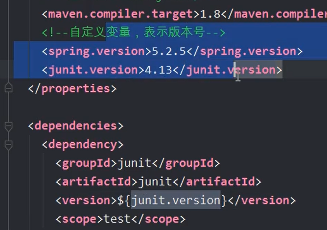

Maven

# 概念

Maven是服务Java的自动化构建工具


这种工具的发展历程		Make -> Ant -> Maven -> Gradle 

②构建：以java源文件，框架配置文件，JSP，HTML，图片等**资源**为原材料去生成一个可运行的项目的过程

1.清理：清理之前编译的东西，为星的编译代码做准备

2.编译：把程序源代码编译为执行代码，java-class（成百上千个）

3.测试

4.生成测试的结果文件

5.jar 和 war

部署：一个BS项目最终运行的不是动态Web工程而是运行的结果

搭建：

# Maven九个核心概念

①POM	——一个名叫pom.xml的 XML文件，pom翻译过来叫项目对象模型

​				maven把一个项目当做一个模型使用。可以控制maven构建项目的过程，管理jar依赖

②约定的目录结构	——maven项目的目录和文件的位置都是规定的。

③坐标	——是一个唯一的字符串，用来表示资源的

④依赖管理	——管理你的项目可以使用jar文件

⑤仓库管理	——（了解）资源存放的位置

⑥生命周期	——（了解）生命周期

⑦插件和目标 	——（了解）执行maven构建的时候用的工具是插件

⑧继承

⑨聚合

# ②约定的目录结构	

​	——maven项目的目录和文件的位置都是规定的。

```
Hello

|---src
|---|---main
|---|---|---java			
|---|---|---resources		配置文件
|---|---test
|---|---|---java
|---|---|---resources
|---pom.xml
Hello	根目录	src：源代码	main主程序 	
```

在src/mvn compile  

# ①POM	

——一个名叫pom.xml的 XML文件，pom翻译过来叫项目对象模型

​				maven把一个项目当做一个模型使用。可以控制maven构建项目的过程，管理jar依赖

## 坐标

<groupId>com.bjpwoernode.maven</groupId>
  <artifactId>ch01-maven</artifactId>
  <version>1.0-SNAPSHOT</version>

### groupId 

域名倒写com.baidu

或者域名倒写加项目名com.baidu.appolo

### artifactId

项目/模块名称

### version

三位数字组成

项目的版本号，如果项目还在开发中，是不稳定版本，通常在项目后加-SNAPSHOT

## packaging

打包以后压缩文件的扩展名，默认是jar

## 依赖

项目要使用的各种资源说明

 <dependencies>
			<!--依赖  java代码中 import -->
		  <dependency>
			<groupId>mysql</groupId>
			<artifactId>mysql-connector-java</artifactId>
			<version>5.1.9</version>
		 </dependency>
 4）properties：设置属性

 5）build ： maven在进行项目的构建时， 配置信息，例如指定编译java代码使用的jdk的版本等	 

## maven命令

**mvn clean**清理(会删除原来编译和测试的目录，即 target目录，但是已经install到仓库里的包不会删除)

**mvn compile**编译主程序(会在当前目录下生成一个 target,里边存放编译主程序之后生成的字节码文件)

**mvn test-compile**
编译测试程序(会在当前目录下生成一个target,里边存放编译测试程序之后生成的字节码文件)mvn test测试(会生成一个目录surefire-reports，保存测试结果)
**mvn package**
打包主程序(会编译、编译测试、测试、并且按照pom.xml配置把主程序打包生成jar包或者war包)

**mvn install** 安装主程序(会把本工程打包，并且按照本工程的坐标保存到本地仓库中)
**mvn deploy**部署主程序(会把本工程打包，按照本工程的坐标保存到本地库中，并且还会保存到私服仓库中。还会自动把项目部署到web容器中)。
**注意∶执行以上命令必须在命令行进入pom.xml所在目录!**

# IDEA中使用Maven

第三部分：
 1.在idea中设置maven ，让idea和maven结合使用。 
   idea中内置了maven ，一般不使用内置的， 因为用内置修改maven的设置不方便。
	使用自己安装的maven， 需要覆盖idea中的默认的设置。让idea指定maven安装位置等信息

	配置的入口 ①：配置当前工程的设置， file--settings ---Build, Excution,Deployment--Build Tools
	               --Maven 
						   Maven Home directory: maven的安装目录
							User Settings File :  就是maven安装目录conf/setting.xml配置文件
							Local Repository :    本机仓库的目录位置
	
					   --Build Tools--Maven--Runner  
						  VM Options : -DarchetypeCatalog=internal
						  JRE: 你项目的jdk


                    archetypeCatalog=internal , maven项目创建时，会联网下载模版文件，
    					  比较大， 使用-DarchetypeCatalog=internal，不用下载， 创建maven项目速度快。


	            ②：配置以后新建工程的设置， file--other settings--Settings for New Project


2.使用模版创建项目
  1）maven-archetype-quickstart : 普通的java项目
  2）maven-archetype-webapp : web工程

第四部分
 1依赖范围， 使用scope表示的。
   scope的值有 compile, test, provided ,默认是compile
	scope:表示依赖使用的范围，也就是在maven构建项目的那些阶段中起作用。
	    maven构建项目  编译， 测试 ，打包， 安装 ，部署 过程（阶段）


   junit的依赖范围是 test
	<dependency>
      <groupId>junit</groupId>
      <artifactId>junit</artifactId>
      <version>4.11</version>
      <scope>test</scope>
    </dependency>

	<dependency>
	  <groupId>a</groupId>
	  <artifactId>b</artifactId>   b.jar
	  <version>4.11</version>
	</dependency>


	 <dependency>
	  <groupId>javax.servlet</groupId>
	  <artifactId>javax.servlet-api</artifactId>
	  <version>3.1.0</version>          servlet.jar
	  <scope>provided</scope> 提供者
	</dependency>


​	 
   你在写项目的中的用到的所有依赖（jar ） ，必须在本地仓库中有。
​	没有必须通过maven下载， 包括provided的都必须下载。

	你在servlet需要继承HttpServlet( provided) , 你使用的HttpServlet是maven仓库中的。
	
	当你的写好的程序， 放到 tomat服务器中运行时， 此时你的程序中不包含servlet的jar
	因为tomcat提供了 servlet的.jar


第五部分：
  maven常用操作
  1.maven的属性设置
     <properties> 设置maven的常用属性
  2.maven的全局变量
     自定义的属性，1.在<properties> 通过自定义标签声明变量（标签名就是变量名）
	                 2.在pom.xml文件中的其它位置，使用 ${标签名} 使用变量的值



	自定义全局变量一般是定义 依赖的版本号， 当你的项目中要使用多个相同的版本号，
	先使用全局变量定义， 在使用${变量名}


  3.资源插件

  <build>
	<resources>
	<resource>
	<directory>src/main/java</directory><!--所在的目录-->
	<includes><!--包括目录下的.properties,.xml 文件都会扫描到-->
	<include>**/*.properties</include>
	<include>**/*.xml</include>
	</includes>
	<!—filtering 选项 false 不启用过滤器， *.property 已经起到过滤的作用了 -->
	<filtering>false</filtering>
	</resource>
	</resources>
  </build>

  作用： mybatis课程中会用到这个作用

  1. 默认没有使用resources的时候， maven执行编译代码时， 会把src/main/resource目录中的文件拷贝到target/classes目录中。