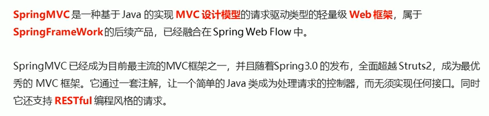
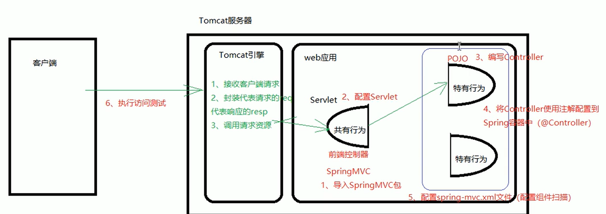
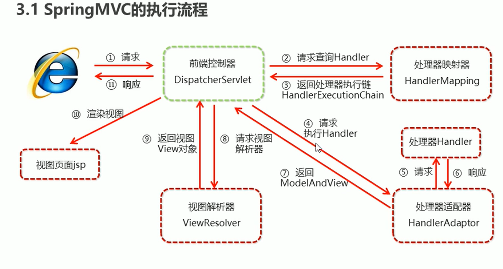

# Spring

1. AOP 面向切面编程

2. IOC容器 inverse反转控制   把DAO层的控制权交给Spring

3. 声明式事务的支持

4. 方便程序测试
5. 方便集成各种优秀的框架
6. 降低API的使用难度

7. 经典的学习源码

# 体系结构


Beans 豆子，对象  				Core 核心       Context上下文         SpEL Spring的EL表达式？

# Sping 快速入门


第一步

导入Spring开发的基本包坐标

第二步

编写DAO 接口和实现impl实现类

第三步

创建XML核心配置文件

第四步

通过id标识配置产生对象的Impl到XML文件中

第五步

使用SpringAPI通过id标识在XML中找到Bean全限定名通过反射创建对象返回


解耦实现：因为XML在以后可以配置新的Impl

## 快速入门我的步骤

首先根据webapp模板新建Maven结构的web项目，完善了目录之后顺便添加UserDao接口及其实现类，


现在Maven的pom.xml文件中添加视频中的Spring5.0.5依赖

```
<dependency>
  <groupId>org.springframework</groupId>
  <artifactId>spring-context</artifactId>
  <version>5.0.5.RELEASE</version>
</dependency>
```

下面开始实现通过applicationContext.xml映射来创建UserDao对象的功能

首先创建上图中的applicationContext.xml 	(右键new一个XMLconfigurationfile中的Spring专用xml)如果new不出来就是依赖导错了或者没刷新maven

xml中添加好对象与实现类的映射关系

```java
<bean id="userDao" class="com.lcha.dao.impl.UserDaoImpl"></bean>
```

然后去具体实现，获取ApplicationContext类对象，

```java
ApplicationContext app = new ClassPathXmlApplicationContext("applicationContext.xml");
```

调用对象方法getBean（）获取对象。

# spring配置

## 1.bean标签基本配置

配置文件内部id不能重复

<bean>**id** = " 唯一ID"  **class** = "全限定名"</bean>

 **默认 通过无参构造创建对象，所以要保证Bean内部存在无参构造**

Scope指对象的作用范围

| scope     | 意义                   | 创建时机                                       | 销毁时机                                |
| --------- | ---------------------- | ---------------------------------------------- | --------------------------------------- |
| singleton | 默认值，单例只能拿一个 | bean在加载配置文件创建Spring容器的时候就创建了 | 销毁容器时，对象就被销毁了              |
| prototype | 多例的 多个对象        | bean在getBean的时候创建                        | 这个被JVM控制，对象长时间不使用就销毁了 |

request     session  	global session WEB环境中创建Bean对象时同时将对象存入对应的域中
init-method：指定对象初始化调用的方法名称
destroy-method： 指定对象销毁之前调用的方法名称

注意：scope等于prototype的时候销毁方法没用，因为有很多实例

**bean实例化的三种方式第一个是重点**

1. 无参构造方法实例化（重点）

   快速入门中的方法

   ```xml
   <!--直接通过Spring构造-->
       <bean id="userDao" class="com.lcha.dao.impl.UserDaoImpl" ></bean>
   ```
   
2. 工厂静态方法实例化

   创建工厂类，**静态方法**中返回实例对象注意是静态方法

   再去applicationContext中配置

   copy Reference（右键类名），将bean中的class属性赋上全限定名全限定名

   再加一个factory-method：创建实例的静态方法get     return new实例方法

   ```
   <!--    通过静态工厂类构造-->
   <!--    <bean id="UserDao" class="com.lcha.factory.UserDaoFactory"-->
   <!--          factory-method="getUserDao"></bean>-->
   ```

3. 工厂实例方法实例化

   ```
   <!--    通过工厂类对象调用工厂类方法构造-->
       <bean id="factory" class="com.lcha.factory.DynamicFactory"></bean>
       <bean id="UserDao" factory-bean="factory" factory-method="getUserDao"></bean>
   ```

# 依赖注入

  Dependency Injection：他是Spring框架核心IOC的具体实现   inverse of control

## 靠set方法注入对象

**靠set方法注入一个对象并调用对象的方法**

通过依赖注入我们可以获得一个    （天然含【有更低层对象（也可以是别的数据类型）作为成员】）  的对象

比如通过Spring容器创建UserService如果想要天然含有UserDao赋予的方法（不是在内部new一个去使用），那么通过set（）方法

**前提**

UserDao有save()方法，UserService想天然地获得这个方法，ps：UserService的成员变量有UserDao但是没有实例化（不能new）

**步骤：**

- 首先创建一个UserService的save()方法，然后方法体内调用类成员UserDao对象的方法，问题是UserDao没有实例化，实际运行会空指针异常，
- **所以我们通过set方法和Spring的配置来自动化的让我们在通过Spring获取UserService时让类成员UserDao实例化**
- set方法就是传统的getSet方法，但是要有参数，参数（形参）是当然就是User对象
- Spring的配置方法：
- 因为我们是想让Spring产生的UserService对象天然具有这个成员，所以我们配置在Spring配置UserService 的Bean标签的 **配置中**

**配置文件******参数如下****

在Bean标签内容中，用property标签来描述**set获得的**这个天然类成员实例

- 我们是根据set方法获取的UserDao的，所以第一个属性name的set方法的方法名（不包括‘set’，首字母不大写）

- 第二个属性ref是想要包含的实例的Spring配置文件中的id，这样Spring才能生成他

  就成了！

  

## P命名空间方法简化上一条的步骤

## 通过构造方法注入对象

**靠构造方法注入一个对象并调用对象的方法**

比如通过Spring容器创建UserService如果想要天然含有UserDao赋予的方法（不是在内部new一个去使用），那么通过构造方法

**前提**

UserDao有save()方法，UserService想天然地获得这个方法，ps：UserService的成员变量有UserDao但是没有实例化（不能new）

**步骤：**

- 首先创建一个UserService的save()方法，然后方法体内调用类成员UserDao对象的方法，问题是UserDao没有实例化，实际运行会空指针异常，

- **所以我们通过构造方法和Spring配置让我们在通过Spring获取UserService时自动化的获取天然的UserDao成员实例**

- 构造方法就是加一个有参的构造方法，来给他给UserDao对象实例化，

  this.userDao=userDao   这个参数来自于容器配置

**Spring的配置**

- 因为我们是想让Spring产生的UserService对象天然具有这个成员，所以我们配置在Spring配置UserService 的Bean标签的 **配置中**

**配置文件******参数如下****

在Bean标签内容中，用Con标签来描述**构造方法**获得的这个天然类成员实例

- 我们是根据构造方法获取的UserDao的，所以第一个参数）

- 第二个属性ref是想要包含的实例的Spring配置文件中的id，这样Spring才能生成他

  就成了！

## 注入集合Map和Properties和普通类型

### 普通类型 

添加这个成员变量和他的set方法

配置

```xml
<bean id="userService" class="com.lcha.service.impl.UserServiceImpl">
        <property name="str" value="张三"/>
        <property name="age" value="12"/>
    </bean>
```

name是成员变量，value是值

### 其他类型

```xml
<bean id="userService" class="com.lcha.service.impl.UserServiceImpl">
    <constructor-arg name="userDao" ref="userDao"></constructor-arg>
    <property name="str" value="张三"/>
    <property name="age" value="12"/>
    <property name="strlist" >
        <list>
            <value>aaa</value>
            <value>bbb</value>
            <value>ccc</value>
        </list>
    </property>
    <property name="userMap">
        <map>
       <entry key="普通String类型" value-ref="user"></entry>
       <entry key="普通String类型2" value-ref="user2"></entry>
        </map>
    </property>
    <property name="properties">
        <props>
            <prop key="p1">ppp1</prop>
            <prop key="p2">ppp2</prop>
            <prop key="p3">ppp3</prop>
        </props>
    </property>
</bean>
```

## 配置数据源

1.导包

2.创建数据源对象

3.

```xml
<?xml version="1.0" encoding="UTF-8"?>
<beans xmlns="http://www.springframework.org/schema/beans"
       xmlns:xsi="http://www.w3.org/2001/XMLSchema-instance"
       xmlns:context="http://www.springframework.org/schema/context"
       xsi:schemaLocation="http://www.springframework.org/schema/beans http://www.springframework.org/schema/beans/spring-beans.xsd
http://www.springframework.org/schema/context http://www.springframework.org/schema/context/spring-context.xsd">
<bean id="dataSource" class="com.alibaba.druid.pool.DruidDataSource">
        <property name="driverClassName" value="${jdbc.driver}"></property>
        <property name="url" value="${jdbc.url}"/>
        <property name="username" value="${jdbc.username}"></property>
        <property name="password" value="${jdbc.password}"></property>
<!--        useUnicode=true&amp;characterEncoding=UTF-8&amp;-->

    </bean>
    
```

# 注解

## 原始注解

要加入组件扫描：

<context:component-scan base-package="com.lcha"/>

主要代替Bean的配置

| 注解           | 说明                                                         |
| -------------- | ------------------------------------------------------------ |
| @Component     | 使用在类上用于实例化Bean                                     |
| @Controller    | 是用在Web层类上用于实例化Bean                                |
| @Service       | 使用在Service层类上用于实例化Bean                            |
| @Repository    | 使用在dao层上用于实例化Bean                                  |
| @Autowired     | 使用在字段上用于根据类型（所以不能有多个Bean类型）依赖注入   |
| @Qualifier     | 结合@Autowired一起使用用于根据名称进行依赖注入               |
| @Resource      | 相当于@Autowired+@Qualifier，按照名称进行注入(name="userDao")填的可以是id值可以是name好像优先name |
| @Value         | 注入普通属性                                                 |
| @Scope         | 标注Bean的范围                                               |
| @PostConstruct | 使用在方法上标注该方法是Bean的初始化方法                     |
| @PreDestroy    | 使用在方法上标注该方法是Bean的销毁方法                       |
|                |                                                              |

## 新注解

原始注解加到一些外部jar包上的Bbean用不了   例如数据池之类很麻烦	@Bean

properties文件的配置   @PropertySource

组件扫描的配置 ，就是扫描那些注解   @ComponentScan 

引入其他Spring配置文件   @Import


| 注解            | 说明                                                         |
| --------------- | ------------------------------------------------------------ |
| @Configuration  | 用于指定当前类是一个Spring配置类，当创建容器时会从该类上加载注解 |
| @ComponentScan  | 用于指定Spring在初始化容器时要扫描的包                       |
| @Bean           | 使用在方法上，该方法返回值存储到Spring容器中（用于配置外部jar包上的对象） |
| @PropertySource | 用于加载.properties文件中的配置                              |
| @Import         | 用于导入其他配置类                                           |

# Spring集成JUnit

## 步骤

1. 导入spring继承junit坐标   junit包和spring-test包
2. 使用@Runwith注解替换也来的运行期
3. 使用@ContextConfiguration指定配置文件或配置类
4. 使用@Autowired注入需要测试的对象
5. 创建测试方法进行测试

# web Spring初体验

## 真的神奇，报了一个错

java.lang.NoClassDefFoundError: org/springframework/context/Appli

https://blog.csdn.net/wangxinyao1997/article/details/88087564

真是缘分


# 获取全局唯一ApplicationContext

## 步骤

坐标导入

```xml
<dependency>
    <groupId>org.springframework</groupId>
    <artifactId>spring-webmvc</artifactId>
    <version>5.0.5.RELEASE</version>
</dependency>
```

Web.xml配置：

```xml
<context-param>
    <param-name>contextConfigLocation</param-name>
    <param-value>classpath:applicationContext.xml</param-value>
    这里的applicationContext.xml是自定义的
</context-param>
<listener>
        <listener-class>org.springframework.web.context.ContextLoaderListener</listener-class>
</listener>
```

Servlet获取

```java
ApplicationContext app = WebApplicationContextUtils.getWebApplicationContext(this.getServletContext());
```

## （底层）

配置如上，设置了一个ServletContext的全局变量用来标识ApplicationContext.xml的寻找方式

获取全局唯一的ApplicationContext的方式是创建

ContextLoaderListener类（监听器继承ServletContextListener）

在类的contextInitialized方法中创建这个ApplicationContext对象并且放到全局域ServletContext中

```java
ServletContext servletContext = servletContextEvent.getServletContext();
//获取全局变量对象ServletContext

String contextConfigLocation = servletContext.getInitParameter("contextConfigLocation");
//从配置文件找到Spring配置文件

ApplicationContext app= new ClassPathXmlApplicationContext(contextConfigLocation);
//获取ApplicationContext全局唯一对象

//存入全局域
servletContext.setAttribute("app",app);
```

# SpringMVC简介





## SpringMVC快速入门

1. 导入SpringMVC的坐标（上一节的配置也要完成）

   ```xml
   <dependency>
       <groupId>org.springframework</groupId>
       <artifactId>spring-webmvc</artifactId>
       <version>5.0.5.RELEASE</version>
   </dependency>
   ```

2. 配置SpringMVC核心控制器

   ```xml
   <!--加载SpringMVC核心配置文件-->
   <servlet>
       <servlet-name>DispatcherServlet</servlet-name>
       <servlet-class>org.springframework.web.servlet.DispatcherServlet</servlet-class>
       <init-param>
           <param-name>contextConfigLocation</param-name>
           <param-value>classpath:spring-mvc.xml</param-value>
      
       </init-param>
       <load-on-startup>1</load-on-startup>
   </servlet>
   <servlet-mapping>
       <servlet-name>DispatcherServlet</servlet-name>
       <url-pattern>/</url-pattern>
   </servlet-mapping>
   ```

3. 创建Controller类和视图页面

   ```java
   @Controller
   //标志这是一个Controller类
   public class UserController {
       @RequestMapping("/quick")//标识他的路径
       public String save(){
           System.out.println("Controller save running ...");
           return "/success.jsp";//返回值代表下一个跳转的路径，根据地址栏的表现可以看出是请求转发
           //这个地方有一个参数被默认了，其实应该是
           return "forward: /success.jsp";指定了他的请求方式是请求转发可以改成
               return "redirect: /success.jsp";
       }
   }
   ```

4. 使用注解配置Controller类中业务方法的映射地址

   @Controller
   //标志这是一个Controller类

    @RequestMapping("/quick")//标识Controller的访问路径

5. 配置SpringMVC核心文件spring-mvc.xml

   

6. 客户端发起请求测试 

## SpringMVC处理流程



1. 用户发送请求至前端控制器DispatcherServlet
2. DispatcherServlet收到请求盗用HandlerMapping处理器映射器
3. 处理器映射器找到具体的处理器（可以根据xml配置，注解进行查找），生成处理器对象及处理器拦截器（如果有则生成）一并返回给DispatcherServlet
4. DipatcherServlet调用HandlerAdapter处理器适配器
5. HandlerAdapter适配后调用定义的Controller（后端控制器）
6. Controller返回modelAndView
7. HandlerAdapter将controller执行结果ModelAndView返回给DispatcherServlet
8. DispatcherServlet将ModelAndView传给ViewReslover视图解析器
9. ViewReslover解析后返回具体的view
10. DispatcherServlet根据View进行渲染视图。DispatcherServlet响应用户

## SpringMVC注解

### **@RequestMapping**

可以作用在类上或者方法上。

作用在类上就是请求URL的第一级访问目录，不写的话就是应用的根目录。

作用在方法上就是请求URL的第二季访问目录，和上面的一起组成访问虚拟路径，

**参数：**

**value：**用于指定请求的URL，**当参数括号里面只写了一个参数就默认是URL参数**

**method：**用于用于指定请求的方式   要求赋值的是枚举类型  例如  RequestMethod类的.POST 

**params：**用于指定限制请求参数的条件，他支持简单的表达式，要求请求参数的key和value必须配置的一模一样

params = {"accountName"},表示请求参数必须有accountName

params = {"money!100"}表示请求参数money不能是100

## 通过配置spring-mvx.xml改变请求前后缀

```xml
<bean id="viewResolver" class="org.springframework.web.servlet.view.InternalResourceViewResolver">
    <property name="prefix" value="/jsp/"></property>
    <property name="suffix" value=".jsp"></property>
</bean>
```

## SpringMVC相关组件

前端控制器：DispatcherServlet

处理器映射器：HandlerMapping

处理器适配器：HandlerAdapter

处理器:Handler

视图解析器：ViewResolver

视图：View

## SpringMVC的数据响应

### 页面跳转

- **直接返回请求资源的路径字符串**

  将返回的字符串与视图解析器的前后缀拼接后跳转

  ```xml
  <bean id="viewResolver" class="org.springframework.web.servlet.view.InternalResourceViewResolver">
      <property name="prefix" value="/jsp/"></property>
      <property name="suffix" value=".jsp"></property>
  </bean>
  ```

  ```java
  @RequestMapping("/1")
  public String save(){
      System.out.println("sinni");
      return "1";
  }
  ```

  这样通过配置文件自动添加了前后缀，在RequestMapping中就直接写文件名省略路径和后缀

- **通过ModelAndView对象返回**

  ```java
  //通过对ModelAndView对象的具体设置获取到数据域和页面跳转
  @RequestMapping("/2")
  public ModelAndView save2(){
      ModelAndView modelAndView = new ModelAndView();
      modelAndView.setViewName("page1");
      modelAndView.addObject("username","2");
      return modelAndView;
  }
  //通过String类型路径返回值跳转页面，通过参数Module设置数据域
  @RequestMapping("/3")
  public String save3(Model model){
      model.addAttribute("username","3");
      return "page1";
  }
  //通过参数获取Spring提供的HttpServletRequest 对象进行数据域的操作
  @RequestMapping("/4")
  public String save4(HttpServletRequest request){
      request.setAttribute("username",4);
      return "page1";
  }
  ```
  
  

### 回写数据

- 直接返回字符串

  ```java
  //通过参数获取Spring提供的HttpServletResponse对象进行写入操作
  @RequestMapping("/5")
  public void save5(HttpServletResponse resp) throws IOException {
      resp.getWriter().write("5的数据");
      resp.getWriter().print("5的数据");
  }
  
  //通过@ResponseBody把本身是资源路径标识的String类型返回值转换为写入到页面的String
  @RequestMapping("/6")
  @ResponseBody
  public String save6(){
      String user = "6的数据";
      return user;
  }
  ```

- 返回对象或者集合

```java
//通过<mvc:annotation-driven/>返回了json格式的字符
@RequestMapping("/7")
@ResponseBody
public User save7(){
    User user = new User("haha",22);
    return user;
}//能返回json是因为在spring-mvc配置过 <mvc:annotation-driven/>了
```

## SpringMVC获得数据响应

### 获得基本类型参数

```java
//获得基本类型参数
@RequestMapping("/8")
@ResponseBody
public String save8(String username, int age) {
    System.out.println(username);
    System.out.println(age);
    return username + "的年龄是" + age;
}
```

这边是在请求地址后面直接加上（？键值对&键值对）的形式按照参数的类型获取到就可以得到相应参数了

### 获得pojo类型参数

```java
//获得pojo类型参数
@RequestMapping("/9")
@ResponseBody
public String save9(User user) {

    return user.toString();
}
```

把和上面的一样，不过这次是根据pojo的成员来给值

### 获得数组

```java
//获得数组strs[]
@RequestMapping("/10")
@ResponseBody
public String save10(String[] strs) {
    return Arrays.asList(strs).toString();
}
```

这边还是通过上面的方式，举例

URL?strs=haah&strs=huhu&strs=ttt

（这里的链接关键是看参数，相同参数名赋值多个就是列表）

页面输出

[haah, huhu, ttt]

### 获得集合

```java
//获得集合
@RequestMapping("/11")
@ResponseBody
public String save11(VO vo) {
    return vo.toString();
}
```

**通过表单的方式逐一赋值**

```html
<form action="${pageContext.request.contextPath}/11" method="post">
    <input type="text" name="userList[0].name"><br>
    <input type="text" name="userList[0].age"><br>
    <input type="text" name="userList[1].name"><br>
    <input type="text" name="userList[1].age"><br>
    <input type="submit" value="tijn">
</form>
```

### ajax方式获得集合

```html
<script src="${pageContext.request.contextPath}/js/jquery-1.7.2.js"></script>
    <script>
        var userList = new Array();
        userList.push({name:"王汉桑",age:18});
        userList.push({name:"李四",age:181});

        $.ajax({
            type:"POST",
            url:"${pageContext.request.contextPath}/12",
            data:JSON.stringify(userList),
            contentType:"application/json;charset=utf-8"
        });
    </script>
```

```

//ajax方式获得集合
@RequestMapping("/12")
@ResponseBody
public void save12(@RequestBody List<User> userList) {
    System.out.println(userList);
}
```

# 这部分知识看到了

https://www.bilibili.com/video/BV1WZ4y1P7Bp?p=67

