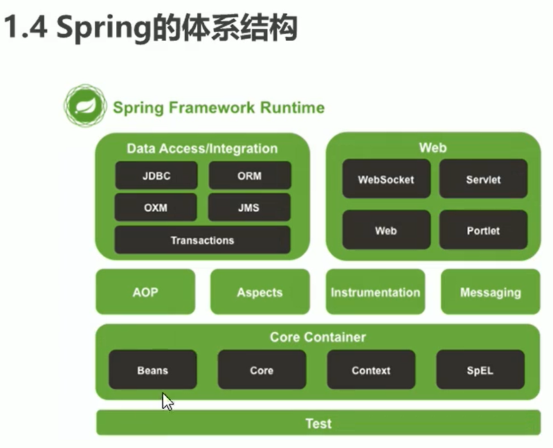
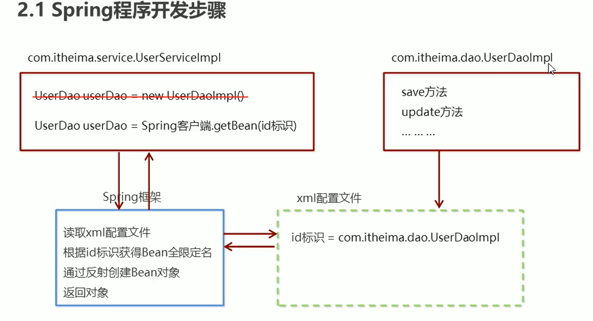
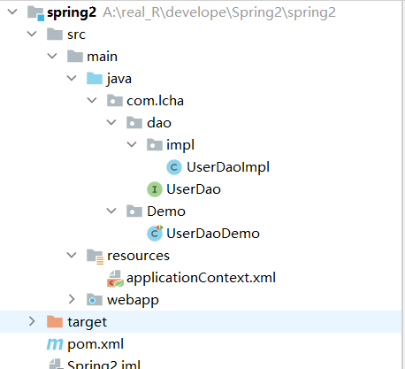

# Spring

1. AOP 面向切面编程

2. IOC容器 inverse反转控制   把DAO层的控制权交给Spring

3. 声明式事务的支持

4. 方便程序测试
5. 方便集成各种优秀的框架
6. 降低API的使用难度

7. 经典的学习源码

# 体系结构



Beans 豆子，对象  				Core 核心       Context上下文         SpEL Spring的EL表达式？

# Sping 快速入门



第一步

导入Spring开发的基本包坐标

第二步

编写DAO 接口和实现impl实现类

第三步

创建XML核心配置文件

第四步

通过id标识配置产生对象的Impl到XML文件中

第五步

使用SpringAPI通过id标识在XML中找到Bean全限定名通过反射创建对象返回


解耦实现：因为XML在以后可以配置新的Impl

## 快速入门我的步骤

首先根据webapp模板新建Maven结构的web项目，完善了目录之后顺便添加UserDao接口及其实现类，



现在Maven的pom.xml文件中添加视频中的Spring5.0.5依赖

```
<dependency>
  <groupId>org.springframework</groupId>
  <artifactId>spring-context</artifactId>
  <version>5.0.5.RELEASE</version>
</dependency>
```

下面开始实现通过applicationContext.xml映射来创建UserDao对象的功能

首先创建上图中的applicationContext.xml 	(右键new一个XMLconfigurationfile中的Spring专用xml)

xml中添加好对象与实现类的映射关系

```java
<bean id="userDao" class="com.lcha.dao.impl.UserDaoImpl"></bean>
```

然后去具体实现，获取ApplicationContext类对象，

```java
ApplicationContext app = new ClassPathXmlApplicationContext("applicationContext.xml");
```

调用对象方法getBean（）获取对象。

# spring配置

## 1.bean标签基本配置

<bean>**id** = " 唯一ID"  **class** = "全限定名"</bean> 默认 通过无参构造创建对象，所以要保证Bean内部存在无参构造

```
scope**：指对象的作用范围

取值范围

singleton 默认值，单例	只能拿一个	销毁容器时，对象就被销毁了

prototype 多例的 	  多个对象 		这个被JVM控制，对象长时间不使用就销毁了

request     session  	global session WEB环境中创建Bean对象时同时将对象存入对应的域中
init-method：指定类中的初始化方法名称
destroy-method： 指定类中销毁方法名称
注意scope等于prototype的时候销毁方法没用
```

 **bean实例化的三种方式**

1. 无参构造方法实例化

   快速入门中的方法

   ```
   <!--直接通过Spring构造-->
       <!--    <bean id="UserDao" class="com.lcha.dao.impl.UserDaoImpl"-->
   <!--           init-method="init" destroy-method="destroy"></bean>-->
   ```

2. 工厂静态方法实例化

   创建工厂类，**静态方法**中返回实例对象注意是静态方法

   再去applicationContext中配置

   copy Reference（右键类名），将bean中的class属性赋上全限定名全限定名

   再加一个factory-method：创建实例的静态方法get实例方法

   ```
   <!--    通过静态工厂类构造-->
   <!--    <bean id="UserDao" class="com.lcha.factory.UserDaoFactory"-->
   <!--          factory-method="getUserDao"></bean>-->
   ```

3. 工厂实例方法实例化

   ```
   <!--    通过工厂类对象调用工厂类方法构造-->
       <bean id="factory" class="com.lcha.factory.DynamicFactory"></bean>
       <bean id="UserDao" factory-bean="factory" factory-method="getUserDao"></bean>
   ```

