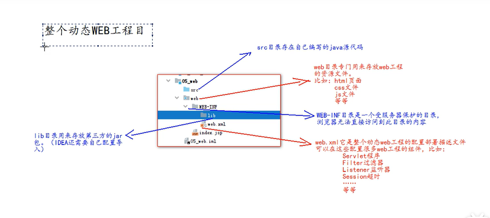

# 实验发现

```java
    @Override
    public void service(ServletRequest servletRequest, ServletResponse servletResponse) throws ServletException, IOException {
        HttpServletRequest h = (HttpServletRequest) servletRequest;
        String method = h.getMethod();
//        try {
//            Thread.sleep(10000);
//        } catch (InterruptedException e) {
//            e.printStackTrace();
//        }
        System.out.println(method);
    }
```

第一次试验请求了一遍发现是瞬间输出method

第二次加上ThreadSleep并且请求两遍发现两次method输出中间**间隔**了十秒

这说明当第一个request处理完之后，第二个才开始睡眠的步骤，两个家伙不是病发的，因此可以通过这一点来防止高频率轰炸

# HTML

## html基础语法

### 标签的属性

1.标签的格式

**<标签名>封装的数据</标签名>**

2.标签名大小写不敏感

**3.标签拥有自己的属性**

①基本属性：可以修改简单的样式，bgcolor="red";

②事件属性: 可以设置事件响应后的代码                onclick="alert:('你好');"//javascript提供的警告框函数，可以接受任何参数，参数就是警告框的函数信息

4.标签分为单标签和双标签

```html
</br>   <!--换行-->
</hr>   <!--一条水平线-->
```

双标签就是常见的。

### html书写规范 

```html
<!DOCTYPE html>
<html lang="en">
<head>
    <meta charset="UTF-8">    <!--表示当前页面使用UTF-8字符集,这行是一个标准的注释-->
    <title>标题</title>
</head>
<body>
    hellow
</body>
</html>
```

html标签分为两部分，分别为head和body，

head一般包括三部分，title ，css样式，js代码  

# 常用标签介绍 

#### font标签

```html
<font color="aqua"face="宋体"size="7">hellow<font/>
```

#### 常用的特殊字符

```html
<      &lt;
>      &gt;
空格   &nbsp

```

#### 标题标签

标题标签是h1到h6,

align是用来对齐的标签属性 下面分别是左对齐，居中对齐，右对齐

```html
        <h1 align="left">标题一<h1/>
            <h2 align="center">标题二<h2/>
                <h3 align="right">标题三<h3/>
                    <h4>标题四<h4/>
                        <h5>标题五<h5/>
                            <h6>标题六<h6/>
```

#### 超链接标签

```html
<a href="http://www.baidu.com" target="_self">百度</a>
<a href="http://www.baidu.com" target="_blank">百度</a>
<a href="http://www.baidu.com">百度</a>
<!--                                默认——self-->
```

超链接的标签属性 target  _self是自己变，_blank是创造新的  

target也可以是某个浮动页面的name属性值

#### 列表标签

##### 无序列表

```html
<ul type="none">
                                    <li>赵四</li>
                                    <li>小沈阳</li>
                                    <li>刘能</li>
                                    <li>宋小宝</li>
                                </ul>
```

ul是列表  li是列表项  type列表标签属性可以修改列表项前面的那个点的样式 

##### 有序列表

#### Img标签

web绝对路径：

http：///ip:port/工程名/资源路径

web相对路径：

.	表示当前文件所在的目录

..	表示当前文件的上一级所在的目录

文件名，指当前目录的文件，省略了 ./

```html
 
```

border 颜色在style属性里面声明，否则会默认为上文font的颜色？？？

#### 表格table

table表格标签

tr是行标签		 		th是表头标签 		td是单元格标签		

cellspacing表格间距属性

b标签会让被套着的字加粗   

可以让某个单元格跨行跨列 

#### iframe标签

能显示一个单独的页面 

iframe标签可以在页面上一小块区域显示一个单独的页面

双标签 

iframe可以和a标签一起用，切换不同的浮动页面	

1.在iframe上面定义一个name属性值，

2.把name属性值给超链接的target属性值

```html
<ul>
    <li><a href="hello.html" target="abc">hello</a></li>
    <li><a href="html2.html" target="abc">html2</a></li>
    <li><a href="html3.html" target="abc">html3</a></li>
</ul>
```

#### label增强鼠标可用性  for属性


#### 表单用来收集信息form

```html
<body>
<!--需求 1:创建一个个人信息注册的表单界面。包含用户名，密码，确认密码。性别（单选），兴趣爱好（多选），国籍（下拉列表）。
隐藏域，自我评价（多行文本域）。重置，提交。-->
<!--
form 标签就是表单
input type=text 是文件输入框 value 设置默认显示内容
input type=password 是密码输入框 value 设置默认显示内容
input type=radio 是单选框 name 属性可以对其进行分组 checked="checked"表示默认选中input type=checkbox 是复选框 checked="checked"表示默认选中
input type=reset 是重置按钮 value 属性修改按钮上的文本
input type=submit 是提交按钮 value 属性修改按钮上的文本
input type=button 是按钮 value 属性修改按钮上的文本
input type=file 是文件上传域
input type=hidden 是隐藏域 当我们要发送某些信息，而这些信息，不需要用户参与，就可以使用隐藏域（提交的
时候同时发送给服务器）
select 标签是下拉列表框
option 标签是下拉列表框中的选项 selected="selected"设置默认选中
textarea 表示多行文本输入框 （起始标签和结束标签中的内容是默认值）
rows 属性设置可以显示几行的高度
cols 属性设置每行可以显示几个字符宽度
-->
<form>
    用户名称：<input type="text" value="默认值"/><br/>
    用户密码：<input type="password" value="abc"/><br/>
    确认密码：<input type="password" value="abc"/><br/>
    性别：<input type="radio" name="sex"/>男<input type="radio" name="sex" checked="checked"/>女<br/>
    兴趣爱好：<input type="checkbox" checked="checked"/>Java<input type="checkbox"/>JavaScript<input
        type="checkbox"/>C++<br/>
    国籍：<select>
    <option>--请选择国籍--</option>
    <option selected="selected">中国</option>
    <option>美国</option>
    <option>小日本</option>
</select><br/>
    自我评价：<textarea rows="10" cols="20">我才是默认值</textarea><br/>
    <input type="reset" value="abc"/>
    <input type="submit"/>
</form>
</body>
```

#### 表单的各种选择样式

```js
<body>
    单选：
    <input name="radio" type="radio" value="radio1" />radio1
    <input name="radio" type="radio" value="radio2" />radio2
    <br/>
    多选：
    <input name="checkbox" type="checkbox" value="checkbox1" />checkbox1
    <input name="checkbox" type="checkbox" value="checkbox2" />checkbox2
    <input name="checkbox" type="checkbox" value="checkbox3" />checkbox3
    <br/>

    下拉多选 ：
    <select id="multiple" multiple="multiple" size="4">
        <option value="mul1">mul1</option>
        <option value="mul2">mul2</option>
        <option value="mul3">mul3</option>
        <option value="mul4">mul4</option>
    </select>
    <br/>

    下拉单选 ：
    <select id="single">
        <option value="sin1">sin1</option>
        <option value="sin2">sin2</option>
        <option value="sin3">sin3</option>
    </select>
</body>
```

#### 还有关于表单的提交和get post请求的关系等

```html
<!DOCTYPE html>
<html lang="en">
<head>
    <meta charset="UTF-8">
    <title>Title</title>
</head>
<body>
<!--
form 标签是表单标签
action 属性设置提交的服务器地址
method 属性设置提交的方式 GET(默认值)或 POST
表单提交的时候，数据没有发送给服务器的三种情况：
1、表单项没有 name 属性值
2、单选、复选（下拉列表中的 option 标签）都需要添加 value 属性，以便发送给服务器
3、表单项不在提交的 form 标签中
GET 请求的特点是：
1、浏览器地址栏中的地址是：action 属性[+?+请求参数]
请求参数的格式是：name=value&name=value
2、不安全
3、它有数据长度的限制
POST 请求的特点是：
1、浏览器地址栏中只有 action 属性值
2、相对于 GET 请求要安全
3、理论上没有数据长度的限制
-->
<form action="http://localhost:8080" method="post">
    <input type="hidden" name="action" value="login"/>
    <h1 align="center">用户注册</h1>
    <table align="center">
        <tr>
            <td> 用户名称：</td>
            <td>
                <input type="text" name="username" value="默认值"/>
            </td>
        </tr>
        <tr>
            <td> 用户密码：</td>
            <td><input type="password" name="password" value="abc"/></td>
        </tr>
        <tr>
            <td>性别：</td>
            <td>
                <input type="radio" name="sex" value="boy"/>男
                <input type="radio" name="sex" checked="checked" value="girl"/>女
            </td>
        </tr>
        <tr>
            <td> 兴趣爱好：</td>
            <td><input name="hobby" type="checkbox" checked="checked" value="java"/>Java
                <input name="hobby" type="checkbox" value="js"/>JavaScript
                <input name="hobby" type="checkbox" value="cpp"/>C++
            </td>
        </tr>
        <tr>
            <td>国籍：</td>
            <td>
                <select name="country">
                    <option value="none">--请选择国籍--</option>
                    <option value="cn" selected="selected">中国</option>
                    <option value="usa">美国</option>
                    <option value="jp">小日本</option>
                </select>
            </td>
        </tr>
        <tr>
            <td>自我评价：</td>
            <td><textarea name="desc" rows="10" cols="20">我才是默认值</textarea></td>
        </tr>
        <tr>
            <td><input type="reset"/></td>
            <td align="center"><input type="submit"/></td>
        </tr>
    </table>
</form>
</body>
</html>
```

####  

# CSS

## css语法规则

link标签用来引入css样式代码 

# JavaScript

## 概述
###### JS 一门运行于解释器的解释性脚本语言
- 运行环境
嵌入浏览器内核的解释器   
NodeJs  
###### js组成三部分
- 一，核心ECMSScrript  
  
- 二，文档对象模型
    有能力和网页对话，如鼠标移动获取之类的
- 三，浏览器对象模型(BOM)
    让JS又能能力和浏览器对话
    ############ 特点
    不用编译，数据决定数据类型
    面向对象
###### 浏览器内核的作用
内容排版引擎剖析html css  
2，脚本引擎解析  JS  

Chrome的Console就是JS代码可以执行的地方
############ 使用位置
- 1，嵌入在元素事件中  
比如点击的时候  把onclick属性放在button的头标签框里面直接让他等于一段JS代码
- 2 ， 嵌入在Script标签中
允许出现在网页的任意位置
- 3， 写在外部脚本文件中**.js
在script头标签中加入一个src属性对应js的文件路径  
注意引入了外部文件的JS标签里面不能写代码  

## JS基本语法元素

大小写敏感  
使用分号表示结束  
sublime text ctrl+/ 注释  

### 变量

内存  
B是Byte  8个bit组成  


赋值

 var 变量名    来声明  
 var 是局部变量 ，不加var默认生成全局变量  

 

未经初始化的变量是undefined 

命名规则和java一样

### 打印

console.log( ) 或者 document.write() 

### 数据类型函数

typeof()对象放括号里面  typeof 对象跟在后面 
############ NaN
isNaN() 判断是否为数字

** 注意，所有类型和String进行+运算时都会变成String类型

任意类型可以用toString()函数转换为String类型
 pareInt()同样的
 parseFloat（）  
 这类的类型转换有一个特点，遇到相对类型的字符就转换，遇到不对应的类型就叫停  
 比如parseFloat("35.4哈哈哈")就会转换成35.4   
 parseFloat("哈哈哈35.4")则为空，因为一遇到非float的字符他就叫停了  


** Unicode字符，数字，标点组成
汉字开头 \u4e00
汉子结束 \u9fa5
"张".charCodeAt().toString(16)  查看字符张的十六进制的表现形式    
\r 回车  \t 制表符    \n 换行  

### 输入

prompt("请输入")  
括号里面是提示性文字

### 函数

函数内容可以看下面尚硅谷的函数部分比较详细

```
funtion 函数名{
    可执行语句；
    console.log("Hloo");
}
```

### 数组

var arr = new Array();  
var arr = [3,23,5,4,123];  
var arr = ["awd","awdw"];
arr[0]=wdad;  
有混合类型数组，可以通过下标直接访问  
数组缩容 arr.length = 4； 
把arr缩小到4长度  

** 数组的三个不限制
不限制元素类型  
不限制下标  
    获取没定义的会返回undefined不报错  
    修改值，修改的越界了就自动扩容  
    下标不连续的数据称为稀松数组  
不限制长度  

############ 关联数组 也就是Map
新建之后赋值的时候直接把下标里面添加想要的数据类型
用增强for遍历   

## 数组API
1.1 String(arr)  :将arr里面每个元素转换为字符串，用逗号分隔  
固定套路：对数组进行拍照：用于鉴别是否数组被修改过  
1.2 arr.join("连接符") ：将arr中每个元素转为字符串  ，用自定义连接符分隔  
**可以拼接字符串数组**

###### join的固定套路用法
1，chars.join("")->无缝拼接  
 可以用来判断数组是否为空  拼接过后如果为""就是空数组  
2.words.join(" ")->单词拼在一起加了空格就是句子  
3.经常把join用在拼接前后标签

** 拼接和选取
concat();返回一个新数组，由一个数组调用，把括号里的数组或者变量拼接到调用数组的后面， 
var arr4 = arr1.concat();

slice()差不多的用法   切片，两个参数含头不含尾巴 单个参数截取到最后 
**负数表示反向的切片位置**  
** 以上两个函数都不会对原数组造成修改 可以找参数接收
**复制数组可以直接让他等于 arr.slice();**

**############ 造成修改的函数splice**
** 双参数
 删除，arr.splice(开始删除元素的位置,删除元素的个数);  
 返回值delete 临时保存被删除的元素
** 多个参数 ，可以替换可以插入
 和删除同一个逻辑，第二个参数（删除元素的个数）是0的时候，相当于插入，别的元素后移 第三个元素开始就是插入的元素，随便加，替换也就是这个逻辑了

 ############ arr.reverse();翻转数组

 ############arr.sort() 默认把所有元素转换为字符串在排序，问题：只能排列字符串

## DOM查找
DOM -> document object model  
DOM是w3c的标准，中立与平台和语言的接口，它允许程序和脚本动态的访问和更新文档的内容结构和样式。  
对网页进行增删改查操作  

############ 按照id查找
var elem = document.getElementById("id")  
特点-效率非常高  
强调-只能用在document；  
何时-只用于精确查找一个元素  
问题-：不是所有元素都有id

############ 按照标签名查找
var elem = parent.getElementsByTagName("div");  
查找指定parent节点下的所有标签为tag的子节点  

强调： 
1.可用于任意的父元素  
2.不仅查看子节点，而且查完所有子代节点  
3.返回一个动态集合  
 即使只查找一个元素，也返回集合  
必须用[0],取出唯一元素  
        
问题： 不但找直接，而且寻找所有子代

############ 通过name属性查找    name属性在头标签里面定义
document.getElementsByName('name属性值')  
可以返回DOM树中具有指定name属性值的所有子元素集合。  

############ 通过class查找
查找父元素下指定class属性的元素 
var elems = parent.getElemnetsByClassName("class");  
IE9+

############ 通过CSS选择器查找
只找一个元素的话：  
    var elem = parent.querySelector("css选择器");  
    如果选择器匹配了多个，那我们选择一个  
 找多个元素
    var elem = parent.querySelectorAll("css选择器");
    返回非动态集合


## DOM修改
** 核心 DOM
  万能且繁琐  
*1 先获得属性节点对象，在获得结点对象值  
 var attrNode = elem.attributes[下标/属性名]；  
 var attrNode = elem.getAttributeNode(属性名)  

 attrNode.value——属性值  
*2 直接获得属性值  
 var value = elem.getAttribute("属性名")；  
    
** html DOM
  只能html 简单
** 先用简单的，简单的不行再用复杂的
## DOM添加

# JavaScript尚硅谷版本

## JavaScript和Html结合的方式

一种写标签里，一中标签头引入js文件（如下），两种一起的话只执行文件中的

```js
<script type="text/javascript" src="1.js">

</script>
<script>
  alert("jqve?");
</script>
```

## 变量

数值类型：			number

字符串类型：		string

对象类型：			object

布尔类型：			boolean

函数类型：			function

### JavaScript特殊的值：

​	undefined		未定义，所有js变量未被赋予初始值的时候都是undefined

​	null				空值

​	NAN			not a number

### JS中的定义格式

var 变量名 

var 变量名=值

typeof(变量名)

```js
var i;
alert(i);//undefine
alert(typeof(i));//undefine
i=3;
alert(i);//3
alert(typeof(i));//number
i="hahah";
alert(i);//hahah
alert(typeof(i));//string
```

## 关系运算

等于   == 简单的字面值比较

全等于 === 完全的类型都需要一样

例如

var a = 13;

var b = "13";

a==b 为true

a===b 为false

## 逻辑运算

 JS中，0		null		undefined		""(空串)都认为是 false

&& 短路运算，当a和b全为真返回后一个的bool

当a和b有一个为假，返回第一个为假的值

|| 或运算

第一种情况：当表达式全为假的时候，返回

哎呀不说了，就是短路逻辑嘛，什么时候能判断整个表达式的值什么时候就返回

## 数组

（可以看上面的MOOC版本的笔记）

var 数组名 = [];

var 数组名 = [1，‘a’，true];

JS数组不会越界，定义新的会延长数组

数组的遍历

for (var i=0; i < arr.length;i++)

## 函数

```js
function(){
    alert("无参函数被调用了");
}
function(a,b){
    alert("双参函数被调用了");//注意看这里，参数直接写两个自定义变量名，因为类型都是var没必要写
}
//同时需要返回值的语句也不用标明返回啥类型因为都是var
//并且函数可以给名字,上面两个函数可以写成
fun1 = function(){
    alert("无参函数被调用了");
}
fun2 = function(a,b){
    alert("双参函数被调用了");//注意看这里，参数直接写两个自定义变量名，因为类型都是var没必要写
}
//调用的时候也就只需要
fun1();
fun2();//这样

```

JS中函数重载会覆盖上一次的定义

函数中有个arguments隐形参数，在function函数不需要直接定义，但却可以直接来获取所有参数的变量（隐形参数）

可变长参数是一个数组

类似于java中的 (object...args)

访问方法就是在函数内直接使用arguments[0],这样带下标访问  

字符串和数字相加即将会变成字符串的拼接

## 对象

JS两种形式定义对象

Object 形式

var 变量名 = new Object；     **//对象实例(空对象)**

```js
    var student = new Object();
    student.name="王汉桑";
    student.no=22;
    student.fun1=function () {
      return "fuck"+"  "+this.name+"  "+this.no;
    }
    alert(student.name+student.no+student.fun1());
```

**{}花括号形式的自定义对象**		

```js
var a={
    name:"haha",
    no:33,
    fun1:function (){
        alert(this.name+this.no);
    }
};
a.no=22;
a.name="小婊砸";
a.fun1();
```

## 事件

事件是JS中电脑输入设备与页面交互的响应。我们称之为事件

### 常用的事件概念	

onload	加载页面	页面加载完成之后，常用于做JS页面初始化操作

onclick	点击	常用于按钮的点击操作

onblur	失去焦点	常用于输入框失去焦点后，验证其输入内容是否合法

onchange	改变	常用于下拉列表和内容输入框内容发生改变后的操作

onsubmit	提交前	常用于表单提交前，验证所有表单是否合法

### 事件的注册（绑定）

概念：告诉浏览器事件响应后需要执行哪些代码

**静态注册**

通过html标签的事件属性直接赋予需要执行的代码


**动态注册**

通过js代码得到标签的dom对象，再通过dom对象.事件名=function(){}这种形式赋予事件需要执行的代码

动态注册基本步骤：

​	-1 获取标签对象

​	-2 标签对象.事件名=function(){}


### onload

加载页面	页面加载完成之后，常用于做JS页面初始化操作
#### 静态注册onload
```js
<head>
    <meta charset="UTF-8">
    <title>Title</title>
  <script type="text/javascript">
    var fun1 = function () {
      alert("这里写执行的代码")
    }
  </script>
</head>
<body onload="fun1();">

</body>
```
#### 动态注册onload

```js
<head>
    <meta charset="UTF-8">
    <title>Title</title>
  <script type="text/javascript">
    window.onload=function () {
        alert("页面初始化");
    }
  </script>
</head>
<body>

</body>
```

### onclick

#### 静态注册onclick

```js
<head>
    <meta charset="UTF-8">
    <title>Title</title>
</head>

<script type="text/javascript">
    var fun1 = function () {
      alert("静态onclick");
    }
</script>
  
</script>
<body>
  <button onclick="fun1()">按钮1</button>
  <button>按钮2</button>
  <button>按钮3</button>
</body>
```

#### 动态注册onclick

```js
<head>
    <meta charset="UTF-8">
    <title>Title</title>
    <script type="text/javascript">
      window.onload=function (){
        var fun1 = document.getElementById("ll");
        fun1.onclick=function () {
          alert("欢迎来到我的世界，我娇贵的小公主");
        }
      }
    </script>
</head>
<body>
<button id="ll">按钮一</button>
</body>
```

### onblur用于表单

失去焦点	常用于输入框失去焦点后，验证其输入内容是否合法

#### 静态注册onblur

```js
<head>
    <meta charset="UTF-8">
    <title>Title</title>
  <script type="text/javascript">
      function fun1(){
        alert("hry");
      }
  </script>
</head>
<body>
  <form>
      输入框<input type="text" value="" onblur="fun1()"/><br/>
  </form>
</body>
```

动态注册onblur

```js
<head>
    <meta charset="UTF-8">
    <title>Title</title>
    <script type="text/javascript">
        window.onload=function () {
            var dv = document.getElementById("ip");
            dv.onblur=function () {
                alert("u fucked this up");
            }
        }
    </script>
</head>
<body>
<form>
    输入框<input id="ip" type="text" value="" onblur="fun1()"/><br/>
</form>
</body>
```

### onchange	

改变	常用于下拉列表和内容输入框内容发生改变后的操作

#### onchange静态和动态注册

```js
<!DOCTYPE html>
<html lang="en">
<head>
    <meta charset="UTF-8">
    <title>Title</title>
  <script type="text/javascript">
      window.onload=function (){
        var a1 = document.getElementById("ll");
        a1.onchange=function () {
          console.log("pcziiz");
        }
      }
      function fun1(){
        console.log("袍子牛逼");
      }
  </script>
</head>
<body>
<select onchange="fun1()">
  <option>--中国颜值国家队</option>
  <option>蔡徐坤</option>
  <option>吴亦凡</option>
  <option>胡桂涛</option>
</select>
<br/>
<select id="ll">
  <option>--中国颜值nv国家队</option>
  <option>蔡徐坤</option>
  <option>吴亦凡</option>
  <option>胡桂涛</option>
</select>
</body>
</html>
```

### onsubmit	

提交前	常用于表单提交前，验证所有表单是否合法

#### onsubmit静态和动态注册

```js
<!DOCTYPE html>
<html lang="en">
<head>
    <meta charset="UTF-8">
    <title>Title</title>
  <script type="text/javascript">
      var func1=function () {
        alert("不合法");
        return false;//代表阻止提交，前面可以跟条件
      }
      window.onload=function () {
        var ab = document.getElementById("ll")
        ab.onsubmit=function () {
          alert("不合法");
          return false;
        }
      }
  </script>
</head>
<body>
<form action="http://baidu.com" method="post" onsubmit="return func1()">
<!--  //静态阻止提交需要retrun false;-->
  <input type="submit" value="静态提交">
</form>
<!--动态提交-->
<form action="http://pornhub.com" method="post" id="ll" >
  <input type="submit" value="动态提交">
</form>
</body>
</html>
```

## DOM模型
可以看上面mooc笔记
## 正则表达式
var str = "";  一个正则表达式
if(str.test(字符串))      test()方法返回被传入的字符串是否符合

### 定义

var patt = new RegExp("e");

另外一种方式   var patt = /e/;

#### 注意当做正则的变量不是字符串，不用加双引号

表示查找是否含有e

#### 境界一 表示是否含有多个字符

var patt = /[abc]/;

patt.test(被测试字符);

返回boolean

#### 境界二表示是否含有所有小写字母

var patt = /[a-z]/;

#### 境界三是否有数字

var patt = /[1-9]/

#### 境界四是否包括字母数字下划线

var patt = /\w/      这里面是\w   小写w是查找是否有，

大写w   var patt = /\W/  是查找是否有字母数字下划线以外的字符

#### 进阶五$a 和 ^a

var patt = /^a$/;

必须a开头，a结尾

#### 境界六 用户名要求

var patt = /^\w{3,5}$/;

```js
    <script type="text/javascript">

        function onclickfun() {
          var str = /^\w{3,5}$/;
          var tishi = document.getElementById("tishi");//提示字
          var usernameobj = document.getElementById("username");
          var usernametext = usernameobj.value;
            if (str.test(usernametext)) {
                tishi.innerHTML = "";
            } else {
                tishi.innerHTML = "只能有3-5个字母下划线数字组成";
            }
        }
    </script>
</head>

<body>
    用户名：<input type="text" id="username" value="default"/>
    <button onclick="onclickfun()">检验</button>
    <span style="color: red" id="tishi">
    </span>

</body>
```

## 节点的常用属性和方法

节点就是标签对象，但是标签有很多层所以是节点的形式，有父节点子节点；document应该就是最大的父节点

### 方法

通过具体的元素节点调用

getElementsByTagName()

获取当前节点的指定标签名的孩子节点集


apendChild(oChildNode)

方法：可以添加一个子节点，参数是要添加的子节点对象

### 属性

childNodes

属性，获取当前结点的所有子节点

firstChild

属性，获取当前结点的第一个子节点

lastChild

属性：获取当前节点的最后一个子节点

parentNode

属性：获取当前结点的父节点

nextSibling

属性：获取当前节点的下一个节点？

previousSibling

属性：获取当前节点的上一个节点

className

用于获取或设置标签的class属性值

innerHTML

属性，表示获取/设置起始标签和结束标签中的**内容**

innerText

属性：表示获取/设置其实标签和结束标签中的**文本**

createElement()

这个createElement()方法是document专属，不要用别的节点调用好像没啥用

```js
<!DOCTYPE html>
<html lang="en">
<head>
    <meta charset="UTF-8">
    <title>Title</title>
  <script type="text/javascript">
      window.onload=function (){
        var div1 = document.createElement("div");
        div1.innerHTML="";
        document.body.appendChild(div1);
      }
  </script>
</head>
<body>

</body>
</html>
```

# JQuery

概念：DOM对象的数组加上一系列函数

JavaScript 和Query 查询   

辅助JS开发的类库

核心思想：write less  do more实现了很多浏览器的兼容问题

JQuery

## 快速入门

怎么通过JQuery绑定响应事件

先查询到---看代码把——记得要导入JQuery库（代码第一行）

```js
<script type="text/javascript" src="../script/jquery-1.7.2.js">
    
</script>
<script type="text/javascript">
    $(function (){
             $("#btnId").click(function () {
               alert("hellow");
            })
         }
   );
</script>
```

总结一下就是

1，导入库

2.$(function() { } );         在两个套子里面写window.onload=function(){ } 里面写的内容

3.通过JQuery获取对象      $(  " " )  括号里面写通过id就 #id  **别忘了双引号**

4.通过获取到的对象调用响应方法，参数为函数体function（）{ }

## 核心函数 $

```js
//核心函数的4个作用
//传入参数为[函数]时：在文档加载完成后执行这个函数
//传入参数为[HTML字符串]时：根据这个字符串创建元素节点对象
$(function () {
    alert("页面加载完后自动调用");

    $("    <div>" +
        "        <span>hello</span>" +
        "        <span>hello2</span>" +
        "    </div>").appendTo("body");
});
//传入参数为[选择器字符串]时：根据这个字符串查找元素节点对象
$("#id");
$("标签名");
$(".class");
//传入参数为[DOM对象]时：将DOM对象包装为jQuery对象返回
```

## DOM和JQuery互相转换

DOM转JQuery——> 获得DOM对象, $(DOM对象);

JQuery转DOM——>通过下标 取出

## JQuery选择器
### 基本选择器

#id			id选择器

.class		类选择器

element     这个值得**标签选择器**

星号     是全局

//5.选择所有的 span 元素和id为two的元素
            $("#btn5").click(function () {
                **$("span,#two")**.css("background-color","#bbffaa");

 **组合选择器两个结果**合并起来返回

```js
<script type="text/javascript" src="../script/jquery-1.7.2.js"></script>
<script type="text/javascript">

    $(function () {

            //1.选择 id 为 one 的元素 "background-color","#bbffaa"
            $("#btn1").click(function () {
                $("#one").css("background-color", "#abff22");
            });
            //2.选择 class 为 mini 的所有元素
            $("#btn2").click(function () {
                $(".mini").css("background-color", "#bbffaa")
            });

            //3.选择 元素名是 div 的所有元素
            $("#btn3").click(function () {
                $("div").css("background-color", "#aaaeee");
            });

            //4.选择所有的元素


            $("#btn4").click(function () {
                $("*").css("background-color","#bbffaa");
            });
            //5.选择所有的 span 元素和id为two的元素
            $("#btn5").click(function () {
                $("span,#two").css("background-color","#bbffaa");
            })
        }
    )
    ;


</script>
```

### 层次选择器

$("a b")找到所有a标签的b标签后代元素

$("a>b")找到所有a标签下的子元素，不包括孙子

$("a+b")找到a标签后面的第一个b标签，只选跟屁虫

$("a ~ b")找到a标签后面的所有兄弟b标签

```js
<script type="text/javascript" src="../script/jquery-1.7.2.js"></script>
<script type="text/javascript">
   $(document).ready(function(){
      //1.选择 body 内的所有 div 元素 
      $("#btn1").click(function(){
         $("body div").css("background", "#bbffaa");
      });

      //2.在 body 内, 选择div子元素(不包含孙子)
      $("#btn2").click(function(){
         $("body>div").css("background", "#bbffaa");
      });

      //3.选择 id 为 one 的下一个 div 元素 
      $("#btn3").click(function(){
         $("#one+div").css("background", "#bbffaa");
      });

      //4.选择 id 为 two 的元素后面的所有 div 兄弟元素
      $("#btn4").click(function(){
         $("#two~div").css("background", "#bbffaa");
      });
   });
</script>
```

### 基本的过滤选择器（冒号）

**在全元素的环境下筛选如下元素直接$(":条件")**

$("a:first")	获取第一个a标签

$("a:last")	获取最后一个a标签

$("a:even")	查找a标签的的0,2,4索引，也就是实际上的奇数行

$("a:odd")	查找a标签的的1，3，5索引，实际上的偶数行

$("a:eq(index)")	查找表格的index索引的行

$("a:gt(index)")	匹配所有索引值大于index的元素

$("a:lt(index)")	匹配所有索引值小于index的元素

$("a:header")	匹配所有标题元素

$("a:not(select)")	选择a标签的条件下不符合select选择条件的，注意select选择条件中不用加双引号	

$("a:animated")	匹配所有正在执行动画的

```js
<script type="text/javascript" src="../script/jquery-1.7.2.js"></script>
<script type="text/javascript">
   $(document).ready(function(){
      function anmateIt(){
         $("#mover").slideToggle("slow", anmateIt);
      }
      anmateIt();
   });
   
   $(document).ready(function(){
      //1.选择第一个 div 元素  
      $("#btn1").click(function(){
         $("div:first").css("background", "#bbffaa");
      });

      //2.选择最后一个 div 元素
      $("#btn2").click(function(){
         $("div:last").css("background", "#bbffaa");
      });

      //3.选择class不为 one 的所有 div 元素
      $("#btn3").click(function(){
         $("div:not(.one)").css("background", "#bbffaa");
      });

      //4.选择索引值为偶数的 div 元素
      $("#btn4").click(function(){
         $("div:even").css("background", "#bbffaa");
      });

      //5.选择索引值为奇数的 div 元素
      $("#btn5").click(function(){
         $("div:odd").css("background", "#bbffaa");
      });

      //6.选择索引值为大于 3 的 div 元素
      $("#btn6").click(function(){
         $("div:gt(3)").css("background", "#bbffaa");
      });

      //7.选择索引值为等于 3 的 div 元素
      $("#btn7").click(function(){
         $("div:eq(3)").css("background", "#bbffaa");
      });

      //8.选择索引值为小于 3 的 div 元素
      $("#btn8").click(function(){
         $("div:lt(3)").css("background", "#bbffaa");
      });

      //9.选择所有的标题元素
      $("#btn9").click(function(){
         $(":header").css("background", "#bbffaa");
      });

      //10.选择当前正在执行动画的所有元素
      $("#btn10").click(function(){
         $(":animated").css("background", "#bbffaa");
      });
      //11.选择当前没有执行动画的最后一个元素
      $("#btn11").click(function () {
         $("div:not(:animated):last").css("background","#bbffaa")
      });
   });
</script>
```

### 内容过滤选择器：函数

$("a:contains('文本')")		查找包含指定文本的a标签

$("a:empty")	查找不含子元素和文本的空元素	

$("a:parent")	和上一个对应，查找含有子元素或文本的非空元素

$("a:has(:  )")	匹配含有指定标签子元素的标签

```js
<script type="text/javascript" src="../script/jquery-1.7.2.js"></script>
<script type="text/javascript">
   $(document).ready(function(){
      function anmateIt(){
         $("#mover").slideToggle("slow", anmateIt);
      }

      anmateIt();             
   });
   
   /** 
   :contains(text)   
   :empty             
   :has(selector)     
   :parent          
   */
   $(document).ready(function(){
      //1.选择 含有文本 'di' 的 div 元素
      $("#btn1").click(function(){
         $("div:contains('di')").css("background", "#bbffaa");
      });

      //2.选择不包含子元素(或者文本元素) 的 div 空元素
      $("#btn2").click(function(){
         $("div:empty").css("background", "#bbffaa");
      });

      //3.选择含有 class 为 mini 元素的 div 元素
      $("#btn3").click(function(){
         $("div:has(.mini):").css("background", "#bbffaa");
      });

      //4.选择含有子元素(或者文本元素)的div元素
      $("#btn4").click(function(){
         $("div:parent").css("background", "#bbffaa");
      });

   });
</script>
```

### 属性过滤器[中括号]

$("a[属性如id]")	查找含有指定属性的a标签

$("a[属性=value]")	匹配相关属性为指定值的a标签

$("a[属性!=value]")  上一个的取反 	

$("a[属性^=value]")	匹配相关属性值以value开头的a标签

$("a[属性$=value]")	匹配相关属性值以value结尾的a标签

$("a[属性*=value]")	匹配相关属性值包含value的a标签

```
$("a[属性过滤][属性过滤器]")	匹配相关属性值以value开头的a标签
```

```js
<script type="text/javascript" src="../script/jquery-1.7.2.js"></script>
<script type="text/javascript">
	/**
[attribute] 			
[attribute=value] 		
[attribute!=value] 		 
[attribute^=value] 		
[attribute$=value] 		
[attribute*=value] 		
[attrSel1][attrSel2][attrSelN]  
	
	
	*/
	$(function() {
		//1.选取含有 属性title 的div元素
		$("#btn1").click(function() {
			$("div[title]").css("background", "#bbffaa");
		});
		//2.选取 属性title值等于'test'的div元素
		$("#btn2").click(function() {
			$("div[title=test]").css("background", "#bbffaa");
		});
		//3.选取 属性title值不等于'test'的div元素(*没有属性title的也将被选中)
		$("#btn3").click(function() {
			$("div[title!=test]").css("background", "#bbffaa");
		});
		//4.选取 属性title值 以'te'开始 的div元素
		$("#btn4").click(function() {
			$("div[title^=te]").css("background", "#bbffaa");
		});
		//5.选取 属性title值 以'est'结束 的div元素
		$("#btn5").click(function() {
			$("div[title$=est]").css("background", "#bbffaa");
		});
		//6.选取 属性title值 含有'es'的div元素
		$("#btn6").click(function() {
			$("div[title*=es]").css("background", "#bbffaa");
		});
		
		//7.首先选取有属性id的div元素，然后在结果中 选取属性title值 含有'es'的 div 元素
		$("#btn7").click(function() {
			$("div[id][title*=es]").css("background", "#bbffaa");
		});
		//8.选取 含有 title 属性值, 且title 属性值不等于 test 的 div 元素
		$("#btn8").click(function() {
			$("div[title][title!=test]").css("background", "#bbffaa");
		});
	});
</script>
```

### 表单过滤器(冒号)

$(":input")  所有 

:text   :password	:radio	:checkbox	:submit	:reset	:button	:hidden 一种(display=none) 还有一种type=hidden

以上会筛选相应的

还可以筛选

enabled  所有都自动可用

disabled	不能用的，加了这个想选的对勾啥的都选不了

#### 获得的集合可以用each()方法遍历

#### $(":text:enabled").val("val可以设置和获取值");

```
<script type="text/javascript" src="../script/jquery-1.7.2.js"></script>
<script type="text/javascript">
   $(function(){
      
      
/**
:input        
:text     
:password  
:radio        
:checkbox  
:submit    
:image        
:reset        
:button    
:file     
:hidden    

表单对象的属性
:enabled      
:disabled     
:checked      
:selected     
*/
         
         
      //1.对表单内 可用input 赋值操作
      $("#btn1").click(function () {
         $(":text:enabled").val("val可以设置和获取值");
      });
      //2.对表单内 不可用input 赋值操作
      $("#btn2").click(function () {
         $(":text:disabled").val("不可用的也可以用val赋值");
      });
      //3.获取多选框选中的个数  使用size()方法获取选取到的元素集合的元素个数
      $("#btn3").click(function () {
         alert($(":checkbox:checked").length    );
      });
      //4.获取多选框，每个选中的value值
      $("#btn4").click(function () {
         var $a=$(":checkbox:checked");
         $a.each(function () {
            alert(this.value);
         });
      });
      //5.获取下拉框选中的内容  
      $("#btn5").click(function () {
         var $b = $("select option:selected");
         $b.each(function () {
            alert(this.innerHTML);
         });
      });
   }) 
</script>
```

### 元素筛选

```
过滤
eq(index|-index)         
first()                
last()                    
hasClass(class)          
filter(expr|obj|ele|fn)    
is(expr|obj|ele|fn)1.6*    
has(expr|ele)           
not(expr|ele|fn)         
slice(start,[end])           

查找
children([expr])         
closest(expr,[con]|obj|ele)1.6*   
find(expr|obj|ele)              
next([expr])               
nextall([expr])             
nextUntil([exp|ele][,fil])1.6*     
parent([expr])                 
parents([expr])             
parentsUntil([exp|ele][,fil])1.6*  
prev([expr])               
prevall([expr])             
prevUntil([exp|ele][,fil])1.6*     
siblings([expr])            

串联
add(expr|ele|html|obj[,con]) 
```

## JQuery属性

**html()**	相当于innerHTML

**text()**	相当于innerText	

**val()**	相当于value

**attr()**	可以获取或设置属性的值，参数是一个时，就是在获取属性值，两个时就是在设置，但是对于选框，之内返回选中的，没选中又没定义的会返回undefined

**attre()还可以设置自定义属性** 

**prop()**	可以获取或设置属性的值	**这个方法在prop的基础上，对于没有定义的checked属性会返回true或false更加直观**

**但是只推荐用这个方法来操作checked，readOnly，selected，disabled等等**

.prop("checked",true)前一个值用字符串，后一个值用boolean值

### 批量操作选项

就是把val()中添加 [ "value" ];

```js
// 批量操作单选
$(":radio").val(["radio2"]);
// 批量操作筛选框的选中状态
$(":checkbox").val(["checkbox3","checkbox2"]);
// 批量操作多选的下拉框选中状态
$("#multiple").val(["mul2","mul3","mul4"]);
// 操作单选的下拉框选中状态
$("#single").val(["sin2"]);

 $("#multiple,#single,:radio,:checkbox").val(["radio2","checkbox1","checkbox3","mul1","mul4","sin3"]);
```

## DOM增删改操作

### 内部插入插到子元素

apendTo();			a.apendTo(b);					a插到b子元素的末尾成为最后一个子元素

prependTo();			a.prependTo(b);				a插到b子元素的最前面，成为第一个子元素

### 外部插入平级插入				

a.insertAfter(b);		ba		平级插后面

b.insertBefore(a);		ab	平级插前面

### 替换：

a.repalceWith(b)			用b替换a

a.replaceAll(b)			用a替换掉所有的b

### 删除清空	

a.remove()	删除a标签

a.empty()	清空a标签里面的内容

### 案例

```js
<!DOCTYPE HTML PUBLIC "-//W3C//DTD HTML 4.01//EN" "http://www.w3.org/TR/html4/strict.dtd">
<html>
<head>
<meta http-equiv="Content-Type" content="text/html; charset=UTF-8">
<title>Untitled Document</title>
<link rel="stylesheet" type="text/css" href="styleB/css.css" />
<script type="text/javascript" src="../../script/jquery-1.7.2.js"></script>
<script type="text/javascript">
$(function () {
   $("#addEmpButton").click(function () {
      var $n = $("#empName").val();
      var $e = $("#email").val();
      var $s = $("#salary").val();
      // //var $tr = $("<tr></tr>");
      // $("<tr><td>"+n+"</td><td>"+e+"</td><td>"+s+"</td><td><a href=\"deleteEmp?id=003\">Delete</a></td></tr>")
      // .appendTo($("#employeeTable"));

      $("<tr></tr>").append("<td>"+$n+"</td>")
            .append("<td>"+$e+"</td>")
            .append("<td>"+$s+"</td>")
            .append("<td><a href='#'>Delete</a></td>")
            .appendTo("#employeeTable");

      $tr.find("a").click(function () {
         this.parentElement.parentElement.remove();
         return false;
      });
   });


   $("a").click(function () {
      this.parentElement.parentElement.remove();
      return false;
   });
   
})
   
   
</script>
</head>
<body>

   <table id="employeeTable">
      <tr>
         <th>Name</th>
         <th>Email</th>
         <th>Salary</th>
         <th>&nbsp;</th>
      </tr>
      <tr>
         <td>Tom</td>
         <td>tom@tom.com</td>
         <td>5000</td>
         <td><a href="deleteEmp?id=001">Delete</a></td>
      </tr>
      <tr>
         <td>Jerry</td>
         <td>jerry@sohu.com</td>
         <td>8000</td>
         <td><a href="deleteEmp?id=002">Delete</a></td>
      </tr>
      <tr>
         <td>Bob</td>
         <td>bob@tom.com</td>
         <td>10000</td>
         <td><a href="deleteEmp?id=003">Delete</a></td>
      </tr>
   </table>

   <div id="formDiv">
   
      <h4>添加新员工</h4>

      <table>
         <tr>
            <td class="word">name: </td>
            <td class="inp">
               <input type="text" name="empName" id="empName" />
            </td>
         </tr>
         <tr>
            <td class="word">email: </td>
            <td class="inp">
               <input type="text" name="email" id="email" />
            </td>
         </tr>
         <tr>
            <td class="word">salary: </td>
            <td class="inp">
               <input type="text" name="salary" id="salary" />
            </td>
         </tr>
         <tr>
            <td colspan="2" align="center">
               <button id="addEmpButton" value="abc">
                  Submit
               </button>
            </td>
         </tr>
      </table>

   </div>

</body>
</html>
```

## CSS样式操作

addClass('a b')				添加一个或多个样式

removeClass()			删除样式

toggleClass()			有就删除，没有就添加样式

offset()				获取和设置元素的坐标，方法

```js
$divEle.offset({
             top:500,
             left:500
                });
```

```js
<script type="text/javascript" src="script/jquery-1.7.2.js"></script>
<script type="text/javascript">
   

   $(function(){
      
      var $divEle = $('div:first');
      
      $('#btn01').click(function(){
         //addClass() - 向被选元素添加一个或多个类
         $divEle.addClass('redDiv blueBorder');
      });
      
      $('#btn02').click(function(){
         //removeClass() - 从被选元素删除一个或多个类 
         $divEle.removeClass('redDiv');
      });
   
      
      $('#btn03').click(function(){
         //toggleClass() - 对被选元素进行添加/删除类的切换操作 
         $divEle.toggleClass('redDiv')
      });
      
      
      $('#btn04').click(function(){
         //offset() - 返回第一个匹配元素相对于文档的位置。
          console.log($divEle.offset());
          $divEle.offset({
             top:500,
             left:500

          });
      });
      
   
      
   })
</script>
```

## JQuery动画

**基本动画**

show();		显示

hide();		隐藏

toggle();		开关灯

**淡入淡出动画**

 可以没参数，第一个参数是动画速度，第二个参数是回调函数，是用了就会运行

fadeIn()	淡入  

fadeOut()	淡出	

fadeTo()	指定的市场内慢慢讲透明度修改到指定的值0~1

fadeToggle()	淡入淡出切换

**注意，这篇代码主要是通过一部分内容是否被遮住进行分类**

```js
$(".showmore a").click(function(){
   if(category.is(":hidden")){
      category.show();
      $promoptedCategory.addClass("promoted");
      $(".showmore a span").text("显示精简品牌")
                      .css("background", "url(img/up.gif) no-repeat 0 0");
   }else{
      category.hide();
      $promoptedCategory.removeClass("promoted");
      $(".showmore a span").text("显示全部品牌")
                      .css("background", "url(img/down.gif) no-repeat 0 0");
   }
   
   return false;
});
```

## JQuery事件操作

### JQuery和js原生页面加载的区别

$(function(){});     			JQuery页面加载

window.onload = function( ) { };		原生页面加载


**JQuery的页面加载完成之后是浏览器的内核解析完页面的标签创建好DOM对象之后马上执行**	

**原生js的页面加载除了要等创建好DOM对象，还要等标签显示时需要的内容加载完成**

**原生js页面加载只会执行最后一次**

**JQuery页面加载会按照注册顺序依次执行**

### JQuery事件处理方法

onclick = click

onblur = blur

onchang = change

# XML简介

概念：

可扩展的标记性语言

作用：

1.保存数据（这些数据具有自我描述性）

2.项目或者模块的配置文件

3.可以作为网络传输数据的格式（现在以json为主）

### 语法

- lt：less than 小于
- le：less than or equal to 小于等于
- eq：equal to 等于
- ne：not equal to 不等于
- ge：greater than or equal to 大于等于
- gt：greater than 大于

 CDATA区  idea快捷键CD

CDATA语法可以告诉xml解析器，我CDATA里的文本内容，只是纯文本，不需要xml语法解析

XML元素名称可以含字母、数字以及其他的字符，甚至汉语但是区分大小写，不能包含空格，也有单标签双标签，

**每个属性的值必须使用 引号 引起来**

xml 属性 xml 的标签属性和 html 的标签属性是非常类似的，属性可以提供元素的额外信息 在标签上可以书写属性： 一个标签上可以书写多个属性。**每个属性的值必须使用 引号 引起来。** 的规则和标签的书写规则一致

**XML 文档必须有根元素 根元素就是顶级元素， 没有父标签的元素，叫顶级元素。** 

根元素是没有父标签的顶级元素，而且是唯一一个才行

```js
<?xml version="1.0" encoding="UTF-8" ?>
<!--
<?xml version="1.0" encoding="UTF-8" ?>
以上就是xml的声明
version 表示xml版本
encoding 表示xml本身的编码
-->
<books>
    <book sn="SN766060468604"><!--表示一个图书信息，sn表示图书序列号-->
        <name>时间简史</name><!--name表示图书名称-->
        <author>霍金</author><!--author表示作者-->
        <price>75</price><!--price表示价格-->
    </book>
    <book sn="SN766060468111"><!--表示一个图书信息，sn表示图书序列号-->
        <name>池中金陵</name><!--name表示图书名称-->
        <author><![CDATA[<<<fuufuf>>>]]>王汉桑</author><!--author表示作者-->
        <price>998</price><!--price表示价格-->
    </book>
</books>
```


早期 JDK 为我们提供了两种 xml 解析技术 DOM 和 Sax 简介（已经过时，但我们需要知道这两种技术）

 dom 解析技术是 W3C 组织制定的，而所有的编程语言都对这个解析技术使用了自己语言的特点进行实现。 Java 对 dom 技术解析标记也做了实现。 

sun 公司在 JDK5 版本对 dom 解析技术进行升级：SAX（ Simple API for XML ）

 SAX 解析，它跟 W3C 制定的解析不太一样。它是以类似事件机制通过回调告诉用户当前正在解析的内容。 它是一行一行的读取 xml 文件进行解析的。不会创建大量的 dom 对象。 所以它在解析 xml 的时候，在内存的使用上。和性能上。都优于 Dom 解析。 

第三方的解析： jdom 在 dom 基础上进行了封装 、 dom4j 又对 jdom 进行了封装。

 pull 主要用在 Android 手机开发，是在跟 sax 非常类似都是事件机制解析 xml 文件。

 这个 Dom4j 它是第三方的解析技术。我们需要使用第三方给我们提供好的类库才可以解析 xml

# dom4j 解析技术

```java
    @Test
    public void getDocument() throws DocumentException {
// 要创建一个 Document 对象，需要我们先创建一个 SAXReader 对象
        SAXReader reader = new SAXReader();
// 这个对象用于读取 xml 文件，然后返回一个 Document。
        Document document = reader.read("src/books.xml");
// 打印到控制台，看看是否创建成功
        System.out.println(document);
    }
3.5、遍历 标签 获取所有标签中的内容（*****重点）
    需要分四步操作:
    第一步，通过创建 SAXReader 对象。来读取 xml 文件，获取 Document 对象
    第二步，通过 Document 对象。拿到 XML 的根元素对象
    第三步，通过根元素对象。获取所有的 book 标签对象
    第四小，遍历每个 book 标签对象。然后获取到 book 标签对象内的每一个元素，再通过 getText() 方法拿到起始标签和结
    束标签之间的文本内容
    /*
     * 读取 xml 文件中的内容
     */
    @Test
    public void readXML() throws DocumentException {
// 需要分四步操作:
// 第一步，通过创建 SAXReader 对象。来读取 xml 文件，获取 Document 对象
// 第二步，通过 Document 对象。拿到 XML 的根元素对象
// 第三步，通过根元素对象。获取所有的 book 标签对象
// 第四小，遍历每个 book 标签对象。然后获取到 book 标签对象内的每一个元素，再通过 getText() 方法拿到起始标签和结束标签之间的文本内容
// 第一步，通过创建 SAXReader 对象。来读取 xml 文件，获取 Document 对象
        SAXReader reader = new SAXReader();
        Document document = reader.read("src/books.xml");
// 第二步，通过 Document 对象。拿到 XML 的根元素对象
        Element root = document.getRootElement();
// 打印测试
// Element.asXML() 它将当前元素转换成为 String 对象
// System.out.println( root.asXML() );
// 第三步，通过根元素对象。获取所有的 book 标签对象
// Element.elements(标签名)它可以拿到当前元素下的指定的子元素的集合
        List<Element> books = root.elements("book");
// 第四小，遍历每个 book 标签对象。然后获取到 book 标签对象内的每一个元素，
        for (Element book : books) {
// 测试
// System.out.println(book.asXML());
// 拿到 book 下面的 name 元素对象
            Element nameElement = book.element("name");
// 拿到 book 下面的 price 元素对象
            Element priceElement = book.element("price");
// 拿到 book 下面的 author 元素对象
            Element authorElement = book.element("author");
// 再通过 getText() 方法拿到起始标签和结束标签之间的文本内容
            System.out.println("书名" + nameElement.getText() + " , 价格:"
                    + priceElement.getText() + ", 作者：" + authorElement.getText());
        }
    }
    打印内容
```

Tomcat




# 新建web工程方式

1.new java 类 

add famework选javaEE   web application

Tomcat————右上角add configuration  新建一个web专用的tomcat 

写的时候要导入TOmcat的lib下面servlet-api的包


