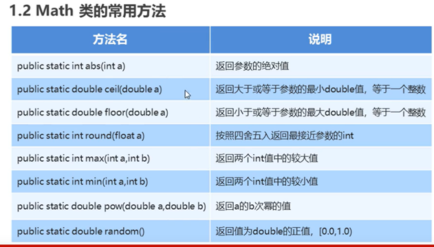
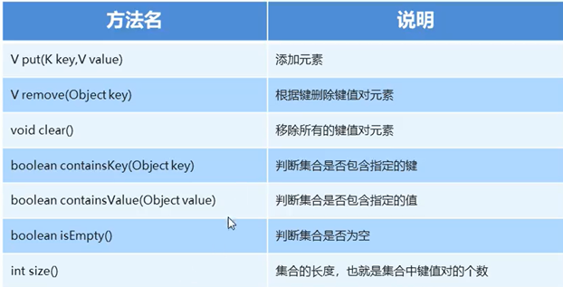
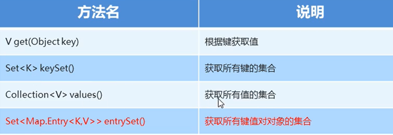

## java开发基础

Java Runtime Environment  —— jre环境

Java Development Kit   ——java开发工具包

Java Virtual Machine JVM  ——虚拟机

### dos命令有

c: a:进入根目录，dos命令对大小写不敏感

dir查看当前目录 cd 进入下一级目录，

cd ..回退一级目录 cd \回到根目录

cls清屏 exit关闭 上下箭头可以切换使用过的命令

### java在cmd中编译运行

首先用记事本编辑好java类文件，命名需要和java类名一致，编辑内容为

```java
public class HellowWorld
{
    public static void main(String[] args){
        System.out.println();
    }
}
```


非法字符一般是中英字符混淆问题

关键字

关键字都是小写，关键字在编译器中会变色，

数字可以直接输出不用当字符串

变量本质是内存上的一小块区域

给long定义赋值的时候不能用被默认成int类型的大数字，在结尾加L才行，如long a=10000000000L

同理给float定义赋值的时候，结尾要加F因为Double是默认浮点类型

变量可以下划线开头

常见命名约定：小驼峰命名法（方法变量）和大驼峰命名法（类）

类型转换(有图)

char 和byte不能转换

小范围赋值给大范围：直接赋值

大范围赋值给小范围：强制类型转换 int a =（int）88.88;   a = 88

 

除了&和 |  还有 ^表示异或，相同则true不同为false

&& 和 | |叫做短路逻辑运算符，逻辑上一样。但是具有短路效果（如果一个条件能获得结果就不执行其他条件）

 

Scanner三步：导包，创建对象，接收数据


### switch语句中的case穿透

case：后面的语句如果不写break，语句会向下执行，执行下一个case，利用这个特性可以把多个条件写在一起

case 1：

case 2：

case 3：XXX；

break；

ctrl c 停止循环

### random

导包，创建对象，取值

import java.util.Random

Random r   = new Random;

int i = r.newInt(0,10);//不包括十

IEDA内容辅助键—— 生成main() 方法：psvm 回车  快速生成输出语句 ： sout回车  ctrl +alt+space 内容提示代码补全等

快捷键 ——

CTRL+/ (选中代码) 单行注释

Ctrl + Shift + / (选中代码) 多行注释

格式化 Ctrl + Alt + L

数组定义格式

1，int[] a;定义数组（推荐这个）

2, int a[];定义变量

数组动态初始化

int[] arr=new int[3]

定义数组类型变量arr  new开辟空间 [3]长度

int[] arr=new int[3]

java中的内存分配

栈内存：存储局部变量

定义在方法里的变量例如：arr

使用完毕，立即消失

堆内存：存储new出来的内容（实体，对象）

 

数组在初始化时，会为存储空间添加默认值

新建空间默认值

int 0  引用 none boolean false 浮点数 0.0 字符默认为空

  每new出来一个东西都有一个地址值

使用完毕，都会在垃圾回收期空闲时被回收

所以数组可以指向数组，因为数组变量本身是指向堆内存的唯一地址，多个数组指向一个地址，就都能改变数组的值；

对象也是！！

数组初始化之静态初始化

int[] arr=new int[]{1,2,3,4,2}

简化写法

 int[] arr={1,2,3,4,2}

空指针异常 arr=nulll 

null是引用类型的默认值

数组索引越界异常：ArrayIndexOutOfBoundsException

空指针异常：

NullPointorException

长度数组名.length

 

方法同类同名就是重载，参数可以不同种类不同个数

方法：public static void XXX（）

类方法 public void XXX（）{}

对于private变量我们用public 方法提供get()和set() 方法

局部变量和成员变量同名的时候，this. 可以修饰成员变量

如果不提供构造方法，系统将默认给出一个无参的构造方法，如果提供了构造方法系统就不会提供，这个时候要注意想要无参数的构造类对象需要自行添加一个无参的构造函数

推荐无论是否使用都手工书写无参的构造方法

java.lang不用导

Ctrl+Alt+V自动添加一个变量来接受类方法的返回值

字符串效果上相当于字符数组char[]，底层上是字节数组 byte[] 

给String赋值三种方式

直接赋值 String a="awdawd"

字符数组赋值  char[]  a = {'a','w','s','l'} ;    String b = new String(a);

字节数组赋值  byte[] a = {99,98,97};  String b = new String(a)

String通过字符数组赋值的时候（new出来的）两个String对象就算内容相同，堆内存中位置不同的原因也会在相等的boolean判断的时候成false

String通过直接赋值的时候两个String对象长得一模一样，那他们相等的boolean就是true

String直接赋值的String对象的变量存在变量池里面，长得一样就地址相同

基本类型==比较的是大小是否相同 

引用类型==比较的是地址是否相同

需要比较new出来的和直接赋值的两个String的内容的话，用equals equals是String的一个成员方法，用其中一个String对象调用，参数括号里面写另外一个，Boolean、返回值

charAt() 对象用法 ， String的charAt() 括号里面是角标

String的Split方法返回[]String 类型

 

 

 

String为什么不能更改，我明明改了

因为String指向的是堆内存，如果更改只会新增有新的指向位置，并不更改内存中的

ArrayList<String> arr= new ArrayList<String>();

arr.add("bbb");  arr.add(3,"aa");

arr.remove("aa");删除指定元素

arr.remove(1);删除指定索引的元素

arr.set(1,"bb");修改指定索引的元素

arr.get(df);获得索引的元素

arr.size();

StringBuilder

String转StringBuilder就是StringBuilder 的构造方法

StringBuilder转String toString方法

添加需要append  反转就是传统艺能

小结：（1）如果要操作少量的数据用 String；

（2）多线程操作字符串缓冲区下操作大量数据 StringBuffer；

（3）单线程操作字符串缓冲区下操作大量数据 StringBuilder。

 

 

Fn+Alt+Insert  自动生成set get 

System.exit(0);————JVM虚拟机退出

\t 就是TAB键，

public class zi extends fu in

this访问本类的成员变量，super访问父类的成员变量

子类的无参构造方法调用的时候为什么会也调用父类的无参构造方法？

子类创建对象时要初始化所有构造方法，父类的构造方法帮他构造了从父类继承过来的数据（类成员）

子类的带参构造方法调用的时候为什么会也调用到父类的无参构造方法？

父类要负责任，别忘了无参构造方法

子类 

但是推荐自己在子类中给出无参构造方法

在用变量时先看局部变量再找成员变量，再找父类成员变量，方法也是

@Overrride

帮我们检查重写方法的正确性

子类方法访问权限不能更低

私有方法不能被继承

父类的带参的构造函数可以给子类带参函数赋值

super(name,age);放里面

使用别的包下的类需要导包方便一些，import 包名就可以，一直点 .  到类名

权限修饰符

同一个类  > 同一个包(包括子类和无关类）> 不同有关类 》不同包无关类

final 修饰可以修饰成员方法，成员变量，类

final成员变量是常量，不能被赋值

final方法是最终方法，不能被重写

final类是最终类，不能被继承

final修饰局部变量时

基本类型的final数据值不能改变了

引用类型的final地址值不能改变，但地址指向的内容可以改变

对象都是引用类型。。

static静态修饰了的成员变量会被共享，

调用被修饰了的static成员变量使用时尽量直接用类名调用

static 只能访问静态成员

所以main调用的函数都需要static

多态的前提

！有继承/实现关系

和体现

！有方法重写

！有父类引用指向子类对象  父类用自己的构造自己的成员自己的对象

对于对象，编译和运行都看父类

方法编译看父类，运行看右边，因为方法能重写

父类对象引用指向子类对象

多态在对象中的引用，其实就是不同子类在一个类中需要调用不同的父类的重写方法，但是传入时不能传入不同子类，只好用一个父类对象来当做重载参数一样的存在，就是爸爸帮儿子排队，哪个儿子都能来站，这个父类对象也只能调用子类重写父类的方法，调用不了子类的独有方法

反过来父类对象可以被强转型成子类对象 （Cat）Animal 就是

class cast Exception 就是强转了非父类的代码报错

abstract抽象类

继承抽象类必须要重写抽象方法

抽象类虽然不能自己实例化，但是也需要足够的构造函数保证子类需要用到他的类成员的是后能够初始化

父类中的抽象方法的作用就是限定子类必须做某些事情

4/13

 

接口默认成员变量是public static final  没有构造方法 方法只能是抽象方法

接口和抽象类名作为形参和返回值，实际返回的是该接口的实现类对象，函数内用的是抽象类参数的对象参数，用方法的时候用的是传入的实现类对象

内部类可以访问类内私有成员，外部类要访问内部类成员必须创建对象。

直接在别的类的主函数创建不了内部类的对象，创建的时候得是

Out.In dvxl = new Out().In();而且只能内部类是私有才行

如果想要使用私有的内部类对象，需要在外部类里面创建一个专门调用内部类成员的public方法，

别忘了这个专门的方法也需要先创建内部类对象再调用内部类的方法

局部内部类是指在类方法内定义了类，想使用这个类需要调用这个方法，同时这个类的所有内容需要在方法内就创建好，调用好，

匿名内部类就是一个抽象类的子类对象或者说是接口类的实现对象，就是new Inter（）{ }大括号里面重写方法，整体出现的时候需要结尾加；整体可以当做对象使用赋值给一个父类对象或者接口对象

奇怪的一点老师的例子里面需要用到一个接口类的实例调用接口里的方法，按理说过程是创建子类，创建子类对象，重写接口类方法然后直接通过子类对象就可以调用了，但是老师创建了一个操作类，操作类内定义了以接口类对象为参数，用用接口类对象调用了接口类方法，然后在主函数创建操作类对象 ，再建个接口的子类的对象，通过操作类对象调用操作类方法，

传入接口类子类的对象，（相当于自动调用类子类对象的接口类方法），

为什么不直接用接口类子类的对象调用这个方法？？？



在类中重写toString和equals便于输入查看类对象比较两个对象是否相同

int转String 

分别调用自己的包装类  包装类里Integer 和Character是长得不一样，其他都是首字母大写

一个valueOf  一个parseInt

包装类和基本类型的转换可以直接转

 

Date类里面的方法getTime（）和setTime（）SDF simpleDateFormat（）就是赋予Date格式的对象，可以按照指定格式解析String生成Date，也可以按照指定格式解析date生成String（parse）

throws只能抛出异常不能接着执行，throw的用法的话就是需要抛的时候抛一下就行

 

关于Calendar类 创建calendar对象需要调用Calendar.getInstance() 静态方法，其他的函数点出来就会用了，他的月份需要加一

新建异常类，继承Exception或者runtimeException 无参有参数构造函数，然后有参构造方法里面写String，方法体内用super（message）上传

4/14

并发修改异常

list 用迭代器iterator的过程中不能使用add

但是用ListIterator可以用

next 向后遍历

previous 向前遍历

 

数组查询快，增删慢

链表对比数组查询慢增删快

set的实例化对象是HashSet（）

hashCode（）返回对象hash值

hashSet（）需要将用hashcode（）的对象的hashset（）和equals（）重写，自动

hashSet是无序的  LinkedHashSet是有序的

treeSet可以用比较器，然后不能索引，需要在用他的类里面实现Comparable<>并重写规则方法（CompareTo），返回0不添加，返回真就换位，返回假就不变，就是相当于比谁大，降序排列

所以基本类型当泛型的时候要用它对应的包装类类型

TreeSet可以带参，参数里面自动生成一个compare的函数

 

## 泛型（需要补充泛型方法）

**泛型类是类名后面跟<T>其他一样，该换换**

泛型接口是在接口名后跟<T> 其他一样，

4/15

Array，List ，Set 工具类的静态方法：（new时的可变参数）

List<String> l = Arrays.asList("Hellow",""world");

只有set方法可以用，因为set不改变集合大小

List.of 相当于上面Arrays.asList  但是这个方法增删改都不行

同理Set.of  同样的元素会引起异常‘

MAP

Map<String,String> map1 = new HashMap<String><String>();

添加方法map1.put("32","hajizu ")第一次出现添加元素，第二次出现更改元素



实例：

map1.put("32","hajizu");

map1.put("33","yujxyu");

map1.put("43","vuys");

System.out.println(map1);

map1.remove("43");

System.out.println(map1);

System.out.println("————————");

if(map1.containsKey("32")) System.out.println(332);;

System.out.println(map1.containsValue("hajizu"));

System.out.println(map1.size());

 



System.out.println(map1.get(32));

Set<String> strings = map1.keySet();

System.out.println(strings);

Collection<String> values = map1.values();

System.out.println(values);

 

这个是结婚证 的集合，既不是键的集合也不是值得集合，遍历的时候看定义的时候用的类型

Set<Map.Entry<String, String>> en = map1.entrySet();    

for (Map.Entry<String, String> me :en){       System.out.println(me.getKey()+"是"+me.getValue()+"的标志");     }

自动生成大法好

 

以对象为HashMap对象别忘了自动重写equals和Hashcode

 

collections是一个类，是针对集合操作的工具类，

Collections.sort(list)是把list默认从小到大排序，需要按指定顺序就双参数，第二个参数用匿名内部类的方式，Comparator

Collection.reverse（list）你懂得

shuffle（list）是乱序排列，洗牌！！！

 

File类对象

f.createNewFile();

f.mkdir()创建某一目录

f.mkdir()创建目录（多级）

在 某个目录下创建文件————先创建文件路径对象，，然后对象调用对象方法creatNewFile（不能重名）


下面有文件的目录删除不了

重名的文件创建不了

 

4/16

递归两步

确定简化方法  确定出口

递归输出文件夹下所有绝对路径 listfiles是File类方法，返回File对象的集合

文件输出流

FileOutputStream fos = new FileOutputStream(new File("ext\\src\\file\\av.txt"));

fos.write("aaaaaaaaaaaa".getBytes());

fos.close();

构造的时候增加一个true参数达到追加写入的效果

windows \r\n   linux \n  ios \r

try{

}catch{

}finally{

fo.close();}

健壮的程序：


读取值是否-1决定是否读空了

buffered BufferedOutputStream b1 = new BufferedOutputStream(new FileOutputStream("ext\\src\\file\\av.jpg"););

缓冲输出流，用FileOutputStream赋值其他都一样，速度快十倍以上


如上，用OutputSteamWriter和InputSteamWriter可以分别接受（writer方法）和写入中文，写入的时候写完要flush（）刷新，close（）会自动刷新，而且这个方法可以直接写String类型

byte[] b = new byte[1024];

​    int len;

​    while ((len = bi.read(b)) != -1) {

​      bo.write(b, 0, len);

​    }

简化书写，有两个FileWriter 和 FileReader，但是转换编码的时候还是要用父类

然后为了加速又有了BufferedWriter和BufferedReader，

read返回值是读到读到多少个字符  

BufferedWriter newline()函数适合各个系统的换行

相应的BufferReader 有 readline  可以用readline来遍历（这个函数不会读换行符）

String a ;

​    while((a=br.readLine())!=null)

​    {

​      bw.write(a);

​      bw.newLine();

  bwf.lush();

​    }

注意，String a 是必须的，readLine只要执行了就会往下读


 

桥梁

 


 

 

 

 

308有空做一下

 

4/17

JDK7

try(io流对象创建){

流对象操作

}catch（异常名 e）{

e.printstack(

}

不用final自动释放内存

流眼泪，写多级文件复制写了一上午，把根目录和其他分开写，根目录没创建，报错只报递归函数里的子目录找不到

 

流眼泪

 


字节打印流

PrintStream ps = new 。。。（路径）

ps.print()不转码原样输出

ps.write()转码

字符打印流

PrintWriter pw = new 。。。（路径）

pw.write()

pw.flush()刷新

 

pw.printlnz自动换行

建立PrintWriter对象时加第二个参数boolean 设置成true会自动刷新

 

 

对象的流

ObjectOutputStream 初始化的 参数是FileOutputStream和Buffered相似

对象想被序列化必须实现 Serializable接口，不需要重写方法

反序列化流就反过来用，调用readObject（）方法

 

需要序列化的类声明Serializable的UID可以保证加了点方法啥的类不会被认不出来

private static final long serialVersionUID = 42 L

Transient 修饰的对象可以不被序列化


Properties类

可以直接作为map集合使用，但是不能指定泛型，


因为String是object的一种，就这样写setProperty函数使得参数只能用String


Store把集合（所有键值对）的内容存入到文件里面，一个参数是流的一个参数是描述信息可以为空

Reader从文件中读取集合的内容，读取完加入到集合里

因为Writer每次调用如果没有专门追加写入（加True的参数）就会清空原txt所以调用时要准备好

 

线程

平时的程序运行的时候就是一个进程

一个进程有多个执行路径就是多线程，有单个执行路径就是单线程

两个方法用Thread实现多线程

一个是让当前类继承Thread，重写Thread 的run()方法

重写run()方法封装被线程执行的代码，实际运行用start()会自动调用run( )而且是多线程执行，如果用run( )的话只是单纯调用方法

setName getName 来给线程命名和获取命名 注意，类内可以直接调用这个方法来获得名字

但是父类Thread能够直接构造的时候在后面括号里写名字，所以整个子类的构造方法，关键是别忘了我们还要给个无参构造

Thread（）类有些个静态方法

（用类名调用的） 叫做currentTread( ) currentTread( ).getName();

void sleep（毫秒数） 

有setPriority（int a）设置优先级  getPriority（）获得优先级  优先级默认是五 最大10 最低1不能越界

join（）成员方法，调用了的线程一旦开始别人就得等，但是别人开始了或者我开始之前用是没用的

setDaemen（boolean）守护标记，所有线程都有守护标记JVM就退出了

stop方法让线程停止

4/18

第二个是实现Runnable接口，


以下的子类对象指的就是继承了Runnable（）接口。Thread构造方法中，单参数时可以选择String指定线程名也可以选择子类对象帮助实例化，双参数第一个是子类对象帮忙实例化，后一个是String指定线程名称

因为java单继承，所以实现接口的方式不错

接口实现的时候sleep要导包才行，然后getName方法需要用Thread 的static方法currentThread  

我真傻，真的，我单知道？？？忘了要说啥，，记一下input流刷新的问题吧，别一起定义了

synchronized（object）{ （同步代码块）} 多线程 共享数据 多条语句同时执行，数据稳定问题，用一把相同的锁子（提前定义好一个任意对象）直接用  下面的方法更好

synchronized可以修饰方法，在修饰符例如public后面，锁会默认为this为参数

如果方法是静态方法，锁会变成(类名.class)

根据卖票的案例我认为，父类用子类实例化实际上主体还是子类，加入给三个父类传入同一个子类对象来实例化，更改子类对象的值三个父类“对象”的值都会被更改；

 

给大家介绍三对好兄弟，后面的兄弟的成员方法都加了synchronized修饰，线程安全

StringBuffer  StringBuilder

Vector<T>    ArrayList<T>

HashTable<K,V>   HashMap<K,V>

还有一个好爸爸叫Collections

collections有个方法叫synchronized（）可以把后面这些天生不太行的变成有线程安全的（缺代码！！！）

 

lock （ ）接口提供了更加灵活的上锁开锁一类的机制，它的实现类我们用ReentranLock（ ） 

两个方法分别是lock（ ）和unlock（ 用的时候为了防止锁不释放用）try{ Object.lock（）;}finally{ Object.unlock;}


 

一个类想调用别的类的方法就在自己的类里面定义一个别的类的对象，如果想要和别的类的对象（创建在别的地方）产生交互，就利用构造方法把类里面的这个他类对象（）传入构造方法，相当于这个类调用的时候传入了别的类的对象，别的类就会跟着这个类内部的形式对象做相同的事

事  第二次理解，目前就是


 

 

网络编程

1.pc通过ip地址找到对方

2.端口号是程序的标识

3,协议 制定了规则 常见的协议有UDP和TCP协议

IP地址

IPV4 和IPV6

IPv4

32 bit地址——四个字节——根据TCP/IP协议

四个字节写成十进制 就变成 192.168.1.66这种

IPv6

128 bit——16个字节，分成8组16进制数

 

常用命令

ipconfig：查看本机ip

ping ip地址：检查网络是否连通

 

特殊ip地址

127.0.0.1；

 Class InetAddress

静态方法 getByName（String host）确定主机名称的IP地址。主机名称可以是极其名称，也可以是IP地址

String getHostName（）获取此IP地址的主机名

String getHostAddress（）返回文本显示中的IP地址字符串

我的主机名是god

端口

两个字节表示的正整数 0~65535

0~1023之间的端口号用于一些知名的网络服务和应用，普通的程序需要使用1024以上的端口号

端口号被别的程序或者服务占用会导致当前程序启动失败

协议

UDP协议User Datagram Protocol

UDP是无连接通信协议，即在数据传输时发的人只管发，收的人只管收，不确定对方是否存在，也不反馈，就无法保证数据的完整性和正确性，

消耗资源小，通行效率高，用在音频视频普通数据的传输

综上两点适合视频会议，不适合传数据

TCP协议叫做传输控制协议 Transmission Control Protocol

面向连接的协议，建立逻辑连接，提供可靠无差错的数据传输，要明确客户端和服务端，由客户端提出连接请求，每次连接的创建都需要

“三次握手”

一，客户端向服务端提出连接请求等待确认

二，服务端说我好了，来吧

三，客户端说我连到你了

应用场景——上传图片，下载文件，浏览网页

UDP  UserDatagramProtocol

不可靠，两端各自建立Socket对象，只能发送接收数据，没有客户端服务端区分，

基于UDP协议java提供了DatagramSocket类

DatagramSocket

发送四步 

创建对象  打包数据  调用对象发送数据 关闭发送端

1.无参构造调用 会任意接口

2.DatagramPacket

DatagramPacket（字节数组byte[ ],int length,InetAddress adress,int port）

构造发送一个数据包  长度为length到指定主机的指定端口

字节数组的构造用String的getBytes（ ）方法

BLAP byte length InetAddress port

3.send（）

4.close（）

接收五步

一，创建DatagramSocket对象 ——带参构造，指定端口port

二，创建数据包————DatagramPacket（bys，length）

三，调用接收—————ds.receive(dp）  

四，解析  ——————dp.getData( ）

byte[ ]转换为String 的时候用String的构造方法转换，再加两个参数一个起点0一个末端dp.getLength()

五，关闭  close（）——ds.close( )

4/19

TCP通信协议

两个Socket对象，一个虚拟的网络链路，通过两端通信端口Socket来产生io流来通信

客户端是Socket类，服务器端是ServerSocket类

客户端发送，服务端，客户端接收

发送三步

一，创建客户端Socket

Socket对象，InetAddress和port

String，port   因为InetAddress.getName()就需要个字符串

二，获取输出流，写数据

Socket（对象）的方法是getOutputStream

然后再用OutputStream对象调用写方法

将字节数组（用String.getBytes()方便）写入os流

三，释放资源

close（）

服务端接收三步

一，创建服务端ServerSocket

二，获取输入流，显示在控制台

三，释放资源

客户端接收四步

一，创建服务器端的Server Socket

二，监听客户端连接，返回一个Socket对象

三，获取输入流，读数据，

四，释放资源

 

Lambda表达式

Lambda就是接口在有唯一抽象方法时重写接口方法的工具

有一个接口，有唯一抽象方法，测试类中定义一个操作方法使用接口（方法的参数是接口）函数体里

用参数的对象调用抽象方法

调用的时候给了抽象方法参数（抽象方法带参数）

然后上面匿名内部类的的时候就会把这个参数传过去（因为匿名内部类重写的时候上面是形参没有实参，实参就在这个操作接口的方法里）

方法名（（抽象方法参数）->{重写抽象类方法}）；

参数类型可以省略，多个参数的情况下不能只省略一个

如果参数只有一个，小括号可以省略即

use（参数 -> {方法体}）；

如果语句只有一句，大括号句尾分号也可以省略

use （参数 -> 语句）

如果单句的情况下有return return必须省略

悟了，这个lambda表达式实际上就是在主函数实例化接口方法用的，和匿名内部类效果一样，

老师讲得例子是自定义了一个需要接口类型做参数的方法来使用lambda函数，实际上有一些天然需要接口类型做参数的场景，比如Thread 在new的时候需要传入一个接口类型的对象 甚至就是需要一个接口类对象

ps：需要一个线程跑起来可以直接new Thread（）.start

Lambda（必须是一个接口）

 

匿名内部类和Lambda的区别

匿名内部类可以是接口，可以是抽象类，还可以是具体类，取个外号，匿名内部类就是."临时对象"

匿名内部类可以重写有多个抽象方法的接口，Lambda不行

Lamda会生成专门的字节码文件

4/20

接口的进化更新

接口本来只有静态常量和抽象方法

java 8 有了默认方法和静态方法

java9 有了私有方法

接口中所有的抽象方法都应该被重写，如果已经有类实现了接口，接口又添加方法获取会让那些之前实现了的类报错

用新的接口再继承不利于java体系，所以引入了默认方法，

pubulic default void（）实现接口升级不破坏现有代码，不强迫实现接口的类重写这个方法， public 可以省略，可以重写，重写的时候不能加Default

静态方法。只能被接口类名调用，然后public也可以省略

私有方法的作用相当于接口方法们的方法，方法本质就是让代码可重用化，接口静态方法里面调用私有方法的时候，私有的方法也需要是静态的

 

lambda可以更加简洁，因为可推倒的就是可省略的

所以有了方法引用

，可以理解成lambda的内容都懒得写就用别人的，把lambda替换成需要的方法比如传入了一个String 然后调用System.out类对象的静态方法println输出参数（写的时候不用加参数）如：

System.out::println就可以了，这就是那个需要被重写的接口方法，一样的构成其他能推倒的自己推到

一 ， 引用类的方法——静态方法

比如Integer parseInt

重申一遍，lambda就是个方法体

写个实例就是先创建好一个B方法（在一个类里）然后创建一个接口类，来了！主函数里面写一个需要接口类为参数的a函数并且在函数里面用到这个参数（用的是这个抽象类参数的方法实际上）——因为lambda方法引用这些就是为了方便的实例化接口，然后主函数调用a函数，a函数的内部就是需要方法，方法体就是B类名：：B方法名

相同的，需要引用类的静态方法用起来的区别就只有不用创建对象直接是 类名：：方法名

 

密码

 

引用构造器的时候要 Studnet ：：new   用new代替构造方法

 

函数式接口

定义：有且只有一个抽象方法的接口‘

java注解@Functional Interface就像当时的重写类一样，标注了编译会帮你检查

万本归宗无论怎么用，lambda，引用方法就是匿名内部类，只不过必须用在@Functional Interface的时候

常用地函数式接口  大写的 T 一般表示类名

Supplier接口

Supplier<T>

T get（）无参方法

用来获得制定数据  生产数据用的，作为方法参数时要指定方法的返回值类型，就像，Supplier<Integer>

Consumer接口

Consumer<T>

操作数据用的

accept（T t）方法、、给t 一个操作，lambda表达式的操作

接下来是:组合函数，就是把前一个函数的返回结果作为下一个函数的参数（所以只能有一个参数）

default Consumer<T>  andThen（Consumer<? super T>after） 方法——理解方式这个就是简化书写，相当于两个或者多个accept的时候（自然是使用多个接口类的参数来调用），来方便书写，，如图


 

Predicate接口

Predicate<T>

四个函数

test（一个参数）

剩下的都是default复杂化这个test的

negate（）否定  and（）短路与 or（）短路或

Function接口

Function<T><T>两个参数！但是注意，不是说真的需要两个参数，实际上还是一个，另外一个参数是指定的返回值类型

指定两个类型有类似于函数重载的效果

方法apply（T t）

default <V>Function andThen(Function after)

:组合函数，就是把前一个函数的返回结果作为下一个函数的参数（所以只能有一个参数）


4/21

Stream流——注意！Stream后面跟上指定泛型<>

stream三步，Collection方法可以把流转换回各个数据结构

一，生成流

通过数据源（集合，数组）生成流

list.stream

三种常见的生成方式

一，Collection体系的常见生成流

调用stream方法

二，Map体系间接生成流

键集合，值集合，entry集合调用stream方法

三，数组通过Stream接口的静态方法of

Stream.of(数组)

二，中间操作

 0到多个中间操作  filter（Predicate pre ）  limit（long maxSize）  skip（long n） 静态方法concat（Sream a，Stream b）；sorted（）sorted（Comparator）

filter（Predicate pre）调用接口（filter：过滤，对流中的数据进行过滤 ）

limit（long maxSize）返回流中的元素组成的流，截取指定参数前的部分（包括指定参数）

skip（long n）返回流中元素组成的刘，截取指定参数后的部分（不包括指定参数）


第一个输出前三个名字，第二个输出那三个以后的所有（也就是后三个），第三个输出去掉前两个的情况下的前两个，也就是第三第四个

静态方法concat（Sream a，Stream b）；合并a和b为一个流

distinct（）返回该流的不同元素组成的流（根据Object equals方法）


sorted（）

sorted（Comparator）回忆一下，自然顺序排列是compare to

map（Function）返回给定函数运用于此流数据结果生成的流这是过程中对应下面结尾是一样的中数据进行函数操作，但是这个是要做完操作返回流，forEach专注于最后的操作

mapToint（Function）和上面的区别是这个的生成的流可以调用sum（）方法

三，终结操作

一个流只能有一个终结操作，

forEach（Consumer）

count（）返回集合中元素数量

 

 

Stream的Collect接口把流转换回各个数据类型（参数里面调用这个接口的方法如——Collectors.toList()

特别的有toMap（）的时候两个参数（lambda表达式）一个对键做操作，一个对值做操作

 

 

类加载器

1，类的加载 2，类的连接 3. 类的初始化

1.类的加载

创建java.lang.Class文件

2.类的连接

验证  是否有正确内部结构，与其他类协调一致

准备  负责为类的类变量分配内存

解析  将类的二进制数据中的符号引用替换为直接引用

3.类的初始化

对类的变量进行初始化

（1）假如类没有被加载和连接，就先加载和连接

（2）假如该类的直接父类未被初始化，先初始化它的父类

（3）假如类中有初始化语句，则系统依次执行这些初始化语句

根据（2），系统每次初始化一个类都会初始化Object类

类的初始化时机

1.创建类的实例

2.调用类的类方法（静态方法 ）

3.访问类或者类接口的类变量，或者为该类变量赋值

4.初始化某个类的子类

5.直接使用java.exe命令来运行某个主类

6.使用反射的方式来强制创建某个类或接口对应的java.lang.Class对象

 

类加载器class Loader

类加载器负责将.class文件加载到内存里并且生成对应的java.lang.Class对象

JVM的类加载机制

1.全盘负责 当一个类加载器负责加载一个类，这个类需要的所有依赖的引用的类都交给他加载

\2. 父类委托 当一个类加载起负责加载一个类，先让它的父类加载器加载，加载不了再自己加载

3.缓存机制  所有加载过得Class都会被缓存，程序需要的时候会先来缓存区搜索

 

爷爷：”爷Bootstrap 类加载器  内置类加载器  表示为null 没有父null 

父亲:Platform class Loader 平台类加载器  可以看到所有平台类，平台类包括由平台类加载器或器祖先定义的Java SE平台

API 其实现类和JDK特定的运行时类

孙子：System class loader 

应用程序类加载器，系统类加载器常用于定义应用程序路径，模块路径和JDK特定工具上的类

static ClassLoader getSystemClassLoader(): 返回委派的系统类加载器

ClassLoader getParent（）：返回父类加载器进行委派


 

## 反射

JAVA反射机制：是指在运行时去获取一个类的变量和方法信息，然后通过获取到的信息来创建对象，调用方法的一种机制。这种动态性，可以极大地增强程序的灵活性，程序不用在编译期就完成确定，在运行期间仍然可以扩展

首先

#### 获取Class类对象的三种方法

！使用类的属性获得  Student.class

！类的对象来调用getClass()方法  stu.getClass   这是个Object方法。所有的java对象都可以调用这个方法

！使用Class类的静态方法forName(String className),该方法需要传入字符串参数，**该字符串参数的值是某个类的安全路径，也就是完整包名的路径**

弹幕：第一种实用性不高，第二种可以在多态下复制对象，第三种可以在程序发布后进行局部升级

这个Class类对象是针对类本身的的，不同的对象啥的不影响

#### 反射获取构造方法并使用

先用上面三种方法中的一种获取Class对象，再用对象调用以下方法

这些方法需要参数的时候参数写在后面的括号里，按照（类型.class）的格式，注意，基本类型也可以这么写

getConstructors 获得一个构造方法组成的数组，因为构造方法不止一种，无参的有参的但是不包括私有默认的

getDeclaredConstructors（）获取包含所有构造方法的数组

getConstructor（）返回单个公共构造方法对象

getDelaredConstructor（）返回单个构造方法对象

然后使用构造方法对象调用newInstance( 构造参数)   使用相应对象接收或帮助其父类对象/接口实例化

#### 暴力反射

（调用私有构造方法的时候）

con. setAccessible（true）(用构造方法调用)

#### 反射获取成员变量并使用

**（别忘了被反射的构造函数一定要健全，参数要写成员变量名）**

还是先获得class对象，再通过class对象调用

getField（变量名）获取公共单个成员变量

getFields（）获取公共成员变量数组

getDeclaredField（变量名）获取公共和私有的单个成员变量

getDeclaredFields（）获取公共和私有的成员变量数组

给成员变量赋值

先用上面的方法构造成员函数

用上面的获取到的Field这个反射成员变量的对象调用set（反射类名，赋值内容）

也有setAccessible（）方法暴力反射调用私有

#### 反射获取成员方法

、、可以看到参数要写成成员函数和需要的参数

还是先获得class 对象，获取构造方法实例化一个对象，在通过class对象调用

getMethod（方法名，需要的参数。。。的.class）获取公共单个成员变量

getMethods（）获取公共成员变量数组

getDeclaredmethod（方法名，需要的参数。。。的.class）获取公共和私有的单个成员变量

getDeclaredMethods（）获取公共和私有的成员变量数组

使用反射来的方法对象Method调用invoke（）方法，参数为实例对象以及方法需要的参数：

Object invoke（）

但是这个反射方法获取函数里有一点不同就是公共的获取获取到的包括所有接口的继承的能用的方法，而Declared获取出来的是私有的成员方法和公共的成员方法

 

### p407必须练

### 模块化java9

模块化基础调用

模块中即使用public修饰也不能用别的模块访问

但是可以配置一个描述文件module-info.java

被用包的模块下配置exports 包名

用包的模块下面配置requires 包名

写模块名报错的是后按下Alt+Enter提示然后选择模块依赖

模块服务

 服务方：{

模块导出：exports 包名

服务提供：provides 接口名 with 接口实例化类名

}

被服务方：{

声明服务接口：uses 接口名

}

用的时候需要用到类的加载服务实现的工具类  ServiceLoader<S>  

因为实现了Iterable所以可以被加强for遍历

加载方法load（服务接口的class参数）

 

 

 

 