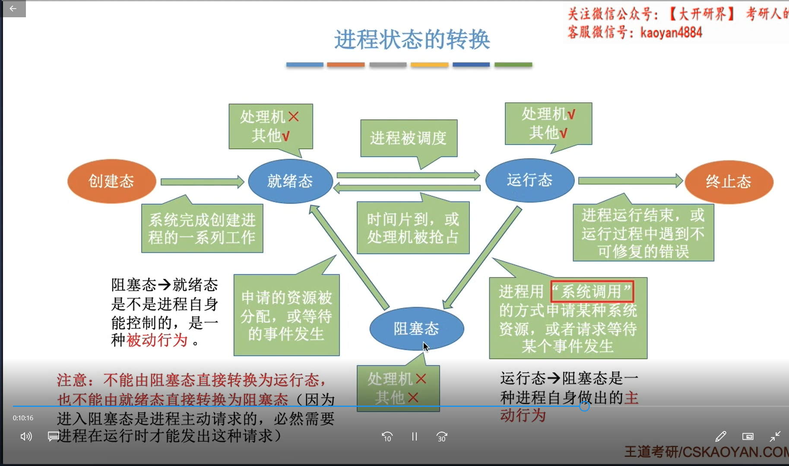

# 第一章 操作系统概述

## 01-概念功能和目标

裸机->操作系统->应用软件->用户

### **①操作系统是系统资源的管理者**

**举例** 

使用qq的过程

1. 文件夹中找到求的位置————————文件管理

2. 打开qq（分配内存）—————————内存管理

3. 运行qq（分配处理机）————————处理机管理

4. 视频聊天（摄像头调用）———————设备管理

   

- **处理机管理**
- **储存器管理**
- **文件管理**
- **设备管理**

### **②向上层提供易用的服务**

### 接口

- GUI

- 联机命令接口

   命令行     用户说一句系统做一句

- 脱机命令接口（批处理）

  .bat文件

- 程序接口（系统调用）

  可以在程序中系统调用来使用程序接口。程序代码间接使用

### **③最接近硬件的软件**

操作系统让各个硬件组织起来，扩展

## 02-操作系统的特征

并发和共享是两个最基本特征，互为存在条件

### 2.1 并发

并发是两个事件同一**时间间隔**发生（宏观同时微观交替）

并行是同一时刻两个事件同时发生

**注意**

**单核CPU**同一时刻只能执行一个所以**单核CPU**各个程序只能**并发**的执行

多核（比如四核）同一时刻可以同时执行四个程序，四个程序并行

 ### 2.2 共享

指的就是资源被多个**并发执行**的进程共同使用

#### 互斥共享方式

一个时间段内只允许一个进程访问

**摄像头**同一时间段只能给一个程序用

#### 同时共享方式

允许一个时间段多个进程对她进行访问

**同时访问文件**宏观上是同时，微观上还是交替

### 2.3 虚拟

物理内存和实际运行的内容不符

虚拟技术中的**空分复用技术**  （4个G的内存玩8个G的游戏）（第三章重点）

**时分复用技术**，在一个时间段看似同时运行多个程序，实际上微观上在各个微小的时间段内交替着为各个进程服务

### 2.4 异步

并发运行时因为资源有限，并发的程序会互相等待，以不可预知的速度向前进行

## 03-操作系统的发展与分类

### 3.1 手工操作阶段

纸带机——超级慢

人机矛盾爆炸

### 3.2 批处理阶段——单道批处理系统

  脱机输入/输出技术（用外围机+磁带）完成，有监督程序负责控制IO 

缺点：程序串行运行，输入输出时间长。浪费**CPU计算**

### 3.2 批处理阶段——多道批处理系统

输入输出分离，一直**CPU计算**

缺点：不提供人机交互功能

### 3.3 分时操作系统

时间片为单位轮流服务

缺点：不能为紧急任务提供服务

### 3.4 实时操作系统

及时性可靠性

硬实时系统

软实时系统

## 04-操作系统运行机制

### 4-1 预备知识

c语——>机器指令 

指令不是命令，指令是二进制的机器指令

### 4-2 内核程序VS应用程序

内核程序就是操作系统内核程序

普通程序员写的是应用程序

内核程序有特权指令

CPU生产时可以区分特权指令和非特权指令

CPU两种状态内核态，用户态

CPU有个寄存器叫程序状态寄存器（PSW）1为内核态（管态）  0为用户态（目态）

**内核态可以执行特权指令修改PSW变成用户态**

用户态执行了黑客的内核态的代码就会**中断**，硬件自动变态

操作系统将强行夺回CPU的使用权处理完之后在还回来

## 05-中断和异常

**中断是操作系统内核夺回CPU使用权的唯一途径**用户态——>内核态

有中断技术才能实施并发

内核态到用户态可以**用特权指令自动修改PSW**变态过去

用户态到内核态只能通过中断方式

#### 5.1 内中断（异常）

来源于CPU内部

与当前执行指令有关

- 例如：有特权指令被执行（终止）

- 例如：除以0，指令本身非法（终止）

- 例如：需要操作系统的内核服务，就执行**陷入指令**内部中断信号（陷入）
- 还有一种故障，例如缺页故障

#### 5.2外中断

来源于CPU外部

与当前执行指令无关

- 例如：时钟部件每隔一个时间片，发送一个时钟中断信号（**并发**）
- 例如：IO设备例如打印机输入输出任务完成通知CPU

CPU会在每个指令结束后看看有没有外中断

 ### 5.3中断机制基本原理

不同中断信号类型有不同的中断处理程序

**通过“中断向量表”**

## 06-系统调用

### 6-1什么是系统调用

底层接口，可供应用请求操作系统服务

### 6-2系统调用和库函数的区别

系统调用是比高级语言的库函数更接近底层

**系统调用是操作系统提供的**

高级语言是隐藏了系统调用细节

不是所有库函数都会使用系统调用。比如取绝对值，不涉及系统服务

### 6-3小例子：系统调用存在的必要性

两个人用打印机，。。

并发进程对共享资源的互斥访问时，内核通过合理调用**系统调用**就可以避免奇葩问题

#### 6-4系统调用按功能分类

- 设备管理		请求释放启动
- 文件管理         读写创建删除
- 进程控制         进程的创建撤销阻塞唤醒
- 进程通信         进程之间的消息//信号传递
- 内存管理         完成内存分配/回收

### 6-5系统调用的过程

用户程序是用户态，提供完想要服务的参数发出一个陷入指令，CPU内中断变成内核态  

调用陷入指令引发的中断程序，通过寄存器传的刚才给的参数判断要做到系统调用有哪些

## 07-操作系统体系结构

### 操作系统的内核

操作系统内部分为内核和非内核

原语：具有原子性，必须运行完才考虑产生的中断之类的

Ubuntu  CentOS开发团队开发的都是非内核部分，用的都是Linux内核

### 两种内核设计方法

- 微内核：内核中只保留和硬件关系特别近的，无各种管理

  优点：内核功能少，结构清晰，方便维护

  缺点：管理那些东西都运行在用户态了，调用 各个管理都会变态，频繁的变态会让CPU变慢

- 大内核：把各个管理也加进来的大内核

  优点：高性能

  缺点：内核代码大，结构乱，难以维护

## 08-番外篇操作系统运行机制

太监是CPU最忙

皇帝是操作系统内核

大臣是应用程序也可以让太监忙。。。。。

# 第二章 进程管理

## 01-进程的概念、组成、特征

### 概念

程序：静态的就是指令集和放在那，多次执行就是多个进程

进程：是动态的，是程序的一次执行过程

多个程序运行的时候PCB不同，

### 组成1PCB（给操作系统使用的）

每新建一个进程就会分配一个唯一PID   

所属的用户ID（UID）、分配资源，各个资源的使用情况。

**这些信息都被保存在一个数据结构PCB中，叫进程控制块**（Process Control Block）

操作系统需要对各个并发运行的进程进行管理，**管理过程中需要的信息都在PCB里面**

 比如上面说的还有处理机相关的PSW（切换内核用户态的值）（用来实现进程切换

）等值 

LINUX的PCB是一个struct task_struct结构体（1900多行）

### 组成2 程序段（给程序自己使用的）

指令序列：程序的代码

### 组成3 数据段（给程序自己使用的）

运行过程中产生的各种数据

### 特征

- 动态性		进程时程序的一次执行过程，动态的产生变化消亡
- 并发性        可以多个进程并发运行
- 独立性        进程能独立运行，独立获得资源，端丽接收调度
- 异步性        各个进程按照不可预知的速度向前推进，操作系统要提供‘进程同步机制’来解决异步问题‘
- 结构性        上述的三部分     

## 02-进程的状态与转换

### 2.1-进程的五状态丁字裤模型

##### PCB中的state变量

- 创建态

  进程被创建期间，操作系统会分配资源、完成对PCB输出化

- 就绪态

  创建完成之后，没有CPU使用权

接下来操作系统选择一个让他上CPU运行

- 运行态

  CPU执行指令表序列

  进程运行时可能会等待某个事件的发生操作系统就会让他下CPU，并且让它进入——————

- 阻塞态

  当导致阻塞的等待事件发生的时候进程又可以回到CPU运行

- 终止态

  执行exit系统调用，请求操作系统终止该进程，进程会进入终止态，操作系统让进程下CPU，回收资源，回收进程的PCB

**进程不能从阻塞态转换为运行态，也不能从就绪态转换到阻塞态**

**运行态到阻塞态是主动的**

**阻塞态转换到就绪态是被动的**（等资源）

运行态可以转到就绪态->时间片到时了，或处理被抢占

**丁字裤模型**

### 2.2-进程的组织

PCB中有state变量，操作系统通过这些参数把进程组织起来

- #### 链式方式

  操作系统管理一系列的队列，每个队列都有指向相应状态的进程的PCB

  通常把优先级高的进程放在队头

  很多操作系统因为阻塞原因把阻塞状态的PCB的指针分为不同的队列

- #### 索引方式（用的很少）

  给各个状态的进程建立索引表，表项指向相应PCB

## 03-进程控制

创建、撤销、**实现进程状态转换**

### 进程控制操作系统需要做什么（使用原语）？

 使用原语

因为原语不能被打断，进程的状态需要一气呵成

①pcb中state变量设置为1

②把pcb从阻塞队列放到就绪队列

这两件事必须一起做，不然PCB表示的状态和所处的队列不一致，就会

### 通过关中断和开中断实现原语的原子性

- #### 创建原语

  - 申请空白PCB

  - 为新进程分配所需资源

  - 初始化PCB

  - 将PCB插入就绪队列

- #### 引起进程创建事件

  - 用户登录	分时系统，用户登录，给一个进程
  - 作业调度
  - 提供服务
  - 应用请求   应用主动请求创建紫禁城

- #### 撤消原语

  - 从PCB集合找到PCB
  - 剥夺CPU
  - 终止其所有子进程
  - 将该进程拥有的所有资源归还给父进程或操作系统
  - 删除PCB

- #### 引起进程终止的事件

  - 正常结束
  - 异常结束
  - 外界干预   用户杀掉

### 父子进程优点

进程间的关系是树形结构，父进程把自己的资源分配给子进程

- 阻塞原语
- 引起阻塞的事件
- 唤醒原语
- 引起唤醒的事件

### 切换原语

还需要保存运行环境

### 保存运行环境：寄存器那些信息也要保存下来

### 引起进程切换的事件

### 所有控制原语做的事

- 更新PCB信息

  修改进程状态，载入 / 恢复运行环境

- 将PCB插入合适的队列

- 分配/回收资源

## 04-进程通信

各进程拥有的**内存地址空间相互独立**

一个进程不能随意访问其他进程的地址空间

**操作系统提供以下三种方式实现进程通信**

**共享空间的访问时互斥的**

### 共享存储

- 基于数据结构的共享

  只能存放一种固定数据结构，限制多，速度慢，低级的通信方式

- **基于储存区的共享**

  **划分共享空间，数据形式存放位置都由进程控制而不是操作系统，相对速度更快限制少，高级的通信方式**

### 管道通信

开辟的一个和**内存页面大小**相同的缓冲区，

1. 管道只能采取半双工通信：**（某一时间段只能实现单向传输）**————要想实现双向通信需要设置两个管道

2. 各进程互斥的访问管道

3. 数据以字符流形式写入管道，管道写满之后某些进程write()系统调用被阻塞，唤醒读进程的read();

   等待读进程将数据取走之后读进程的read()阻塞

4. 没写满不让读，没读空不让写

5. 数据一旦读出就被抛弃，**意味着读进程最多只能有一个，**否则就会出现读错数据的情况。。。。。

   

### 消息传递

格式化消息为单位Message为单位，进程通过操作系统提供的**“发送消息/接收消息”**两个原语进行数据交换

Message有消息头和消息体

消息头有发送进程id，接收进程id，消息类型，消息长度（类似报文）

- 直接通信方式

  直接挂到**接收进程的**消息缓冲队列上，

- 间接通信方式

  发送到中间实体信箱中（发送方和接收方信息挂在消息头里）

## 05-线程多线程模型

### 线程

（基本的CPU执行单元）程序执行流的最小单位————轻量级进程

**qq要用各种功能**

### 引入线程后

进程只作为除了CPU以外的系统资源的份分配单元

1. 线程成为调度的基本单位

2. 并发性提高了
3. 切换不同线程时不用切换进程环境，并发开销小

### 其他线程的属性

1. 多核CPU线程可以调用不同的CPU
2. 每个线程有一个线程ID，线程控制块（TCB）
3. 线程也有就绪、阻塞、运行三种基本状态
4. 线程几乎不拥有系统资源，资源是用进程的，统一进程的不同线程共享这个进程的资源
5. 同一进程中的线程间通信不需要系统干预
6. 同一进程内的的线程切换系统开销小

## 06-线程实现的方式

### 6.1 用户级线程

（早期的操作系统）通过代码实现的简单并发

优点：不用切换内核态和用户态

缺点：一个线程被阻塞其他的就得等着，多个线程不能分开在多个CPU上运行

### 6.2 内核级线程

操作系传统也能看得到的线程

优点：线程阻塞了不影响别人，多个线程可以分开在多核CPU上运行

缺点：要频繁切换用户态和内核态，线程管理开销大

### 6.3 多线程模型

把若干个**用户级线程**映射到**内核级线程**

- 一对一模型

  相当于纯内核级线程

- 多对一模型

  相当于纯粹用户级线程

- **多对多模型**

用户线程n >= 内核级线程

用户线程就是【代码逻辑】载体

内核级线程就是【运行机会】载体

## 07-处理机调度的概念、层次

### 7.1 基本概念

当有一堆任务要处理，资源有限，要制定的规则决定顺序

### 7.2 调度的三个层次

#### 7.2.1 高级调度（作业调度）

**从外存往内存调度，频率最低**

作业：一个具体的任务，作业后备队列

每个作业调入一次调出一次，调入建立PCB调出建立PCB

#### 7.2.2 低级调度（进程调度/处理机调度）

**按照某种策略从就绪队列中选一个进程，将处理机分配给他******频率很高****

进程调度是最基本的调度，进程调度频率很高一般几十毫秒一次

#### 7.2.3 中级调度（内存调度）

内存不足的时候，挂起状态，PCB组成挂起队列

**按照策略决定把哪个挂起状态的进程重新调入内存**频率一般

### 7.3 挂起状态的七状态模型

挂起状态（suspend）分为就绪挂起和阻塞挂起两种状态

这两种状态分别是把之前的五状态模型（丁字裤模型）的就绪态、阻塞态的进程挂起产生的

运行态和创建态也有可能挂起到就绪挂起队列

**进程映像：（完整的进程的对象包括进程全部信息）**

**注意**阻塞挂起的进程映像还在内存里，就绪挂起是将内存映像调到外存去了

