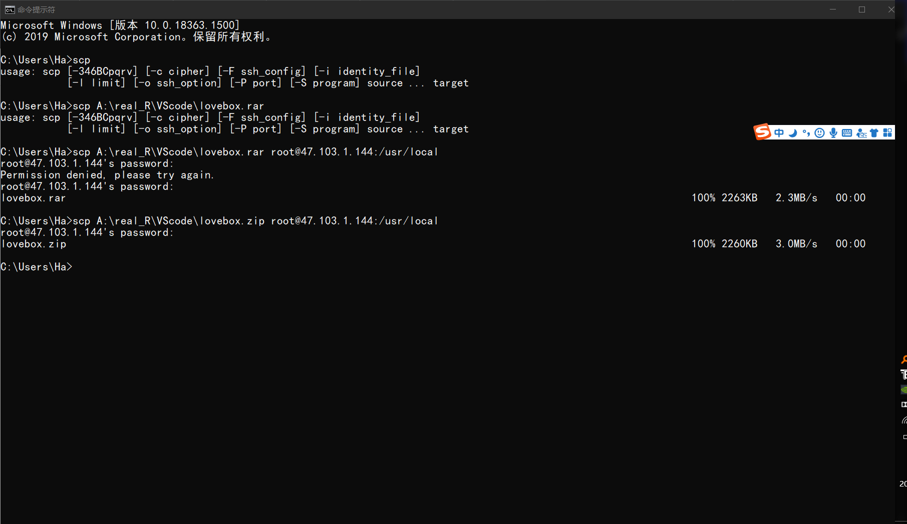

linux怎么安装unzip？

linux安装unzip方法步骤：

1、获取unzip源码

sudo wget http://downloads.sourceforge.net/infozip/unzip552.tar.gz
2、解压

tar zxvf unzip552.tar.gz
3、进入目录

cd unzip-5.52/
4、将Makefile从unix子目录复制到当前目录

cp unix/Makefile ./
5、安装

make generic
make install




上面是本地把压缩文件传上去的方法

unzip用来解压缩，

使用方法是unzip文件名

**输入的ip没有工程名默认是ROOT**

**输入的ip后面加工程名但是没加资源名默认访问“html”页面**

# 快速入门

## MySQL

```
wget http://dev.mysql.com/get/mysql57-community-release-el7-10.noarch.rpm
yum -y install mysql57-community-release-el7-10.noarch.rpm
yum -y install mysql-community-server
```

分别运行，可以看到

https://blog.csdn.net/qq_44866828/article/details/116602544?utm_medium=distribute.pc_relevant.none-task-blog-baidujs_utm_term-1&spm=1001.2101.3001.4242    要小心一点，

ALTER USER 'root'@'%' IDENTIFIED WITH mysql_native_password BY 'passowrd';

这里是为了远程连接更改了加密了密码的方式，但是由于不能获取当前密码只能改密码就在这个语句中改了密码，改了password；

小tip，如果密码忘了进去skip模式（通过修改文件网上找），进入到user里面的时候用修改密码语句

update user set authentication_string = '123' where user = 'root';这里的123必须为空

## Tomcat

https://developer.aliyun.com/adc/scenario/exp/5da5ab85466e46fa852d3f16b167668a?spm=5176.12901015.0.i12901015.30de525ckPUosd

